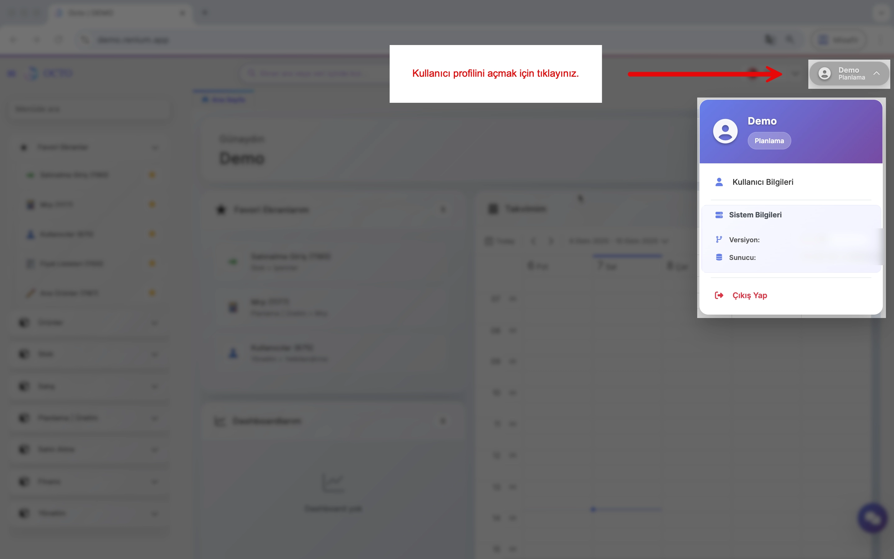

# Hesap Ayarları

## Hesap Oluşturma

Kullanıcı hesapları, **Sistem Yöneticisi** rolündeki kullanıcılar tarafından oluşturulur ve tarafınıza teslim edilir.

:::info
Yeni bir kullanıcıyı nasıl ekleyeceğinizi veya mevcut kullanıcıların yetkilerini nasıl yöneteceğinizi öğrenmek için **[Yetkilendirme](/docs/octo-web/Yetkilendirme/index.md)** sayfasını inceleyebilirsiniz. Bu modül sayesinde:

- Mevcut kullanıcıların yetkilerini yönetebilir,
- Yeni kullanıcı ekleyebilir ve onlara uygun roller atayabilirsiniz.
:::

--- 

## Giriş Yapma

Size iletilen kullanıcı bilgilerini kullanarak giriş yapmak için;

1. Tarayıcınızdan sizin için oluşturulan Octo adresine giderek platformumuza erişebilirsiniz.

2. Size ulaştırılan hesap bilgileri ile; ilgili yerleri doldurup login butonuna tıklayınız. 

3. Bilgiler doğruysa hesabınıza yönlendirileceksiniz ve platformu kullanmaya başlayabilirsiniz.

:::tip
İlk girişinizin ardından güvenliğiniz için şifrenizi değiştirmenizi tavsiye ederiz. Şifrenizi [Kullanıcı Profili](/docs/octo-web/Başlarken/genel_kullanım.md#kullanıcı-profili) ekranından güncelleyebilirsiniz.
:::

---

## Kullanıcı Profili

**Kullanıcı Profili**, ana sayfanın sağ üst köşesinde yer alan kullanıcı adınıza tıklayarak açabileceğiniz bir menüdür. Menü üç bölümden oluşur:

**1. Kullanıcı Bilgileri:**
- Bu butona tıkladığınızda anasayfanızda Kullanıcı Bilgileri sekmesi açılır.
- Sekme içinde hesabınızla ilgili detayları görebilir ve güncelleyebilirsiniz:
  - **Profil Fotoğrafı:** Mevcut fotoğrafınızı görebilir ve _Select File_ ile yeni bir fotoğraf yükleyebilirsiniz.
  - **Kullanıcı Bilgileri:** Hesap adınız ve sistemde hangi rolde bulunduğunuzu görebilirsiniz.
  - **Parola Bilgileri:** Parola değişikliğinizi bu alanda yapabilirsiniz.

**2. Sistem Bilgileri:** Platformun **versiyonu ve sunucu bilgileri** gibi teknik detayları görüntüleyebilirsiniz.

**3. Çıkış Yap:** Hesabınızdan güvenli bir şekilde çıkış yapmak için bu butona tıklayınız.

