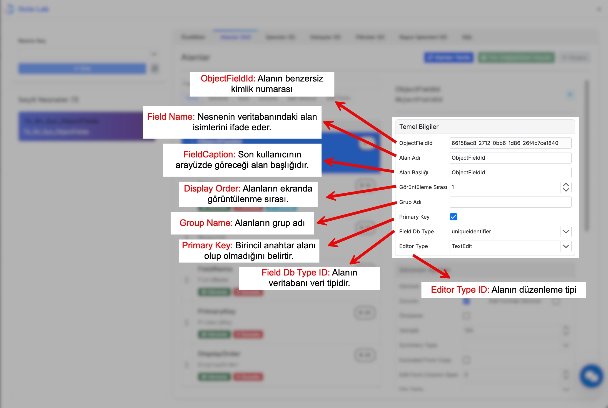
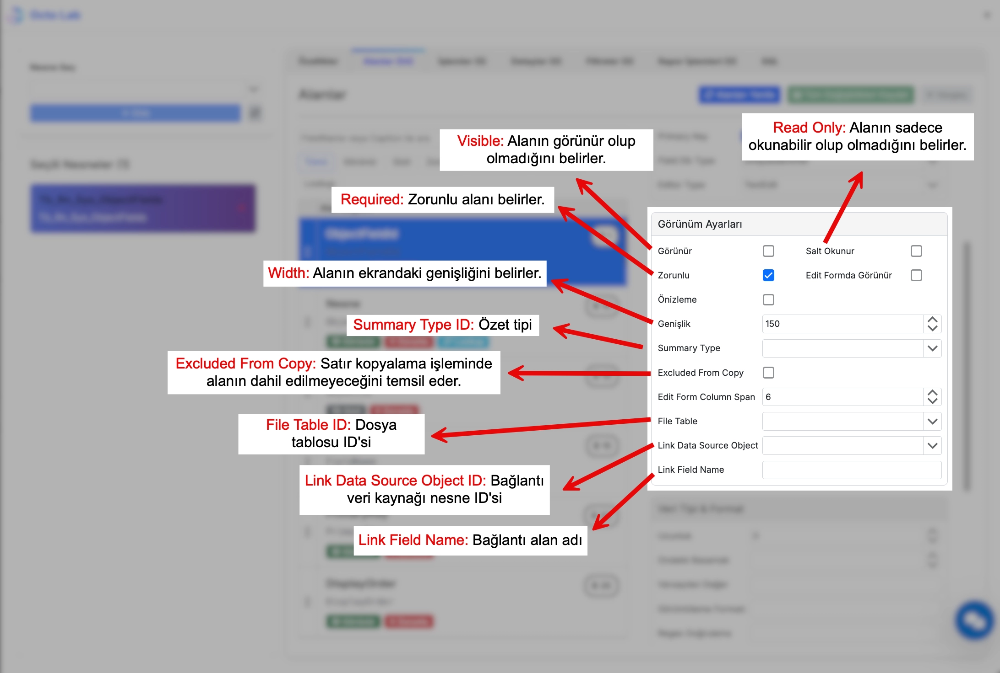
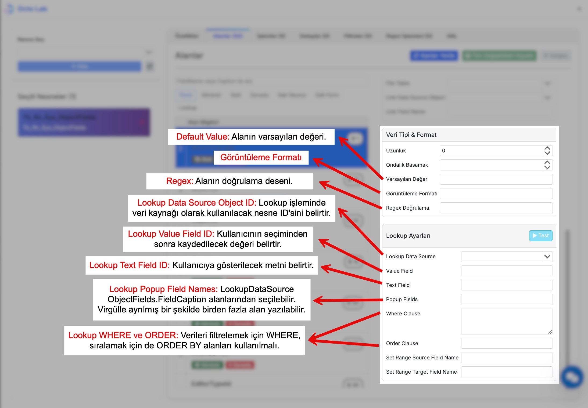

# Alanlar

```Tb_Rn_System_ObjectFields```

Bu bölümde Octo Lab'da kullanılan alan özelliklerini detaylı olarak inceleyeceğiz.

## Ortak Özellikler
---



### ObjectFieldId
- Alanın benzersiz kimlik numarası

### ObjectId
- Bu alanın ait olduğu nesnenin ID'si

### FieldName
- Nesnenin veritabanındaki alan isimlerini ifade eder
- **Önemli**: Veritabanı ile birebir aynı olmalıdır
- Farklı olması durumunda sistem hatalarına neden olabilir
- Büyük/küçük harf duyarlılığına dikkat edilmelidir

:::tip 
```
DB Alan Adı: CustomerName
FieldName: CustomerName ✅
FieldName: customername ❌
```
:::

### DisplayOrder
- Alanların ekranda görüntülenme sırası

### FieldDbTypeId
- Alanın veritabanı veri tipi (int, nvarchar, decimal, datetime vb. )

### EditorTypeId
- Alanın düzenleme tipi (TextEdit, SpinEdit, CheckEdit, DateTimeEdit, DateEdit vb.)

:::tip

Varsayılan olarak aşağıdaki eşleşme kullanılır.

| SQL Veri Tipi Grubu                                                                                     | Editör Adı     | Açıklama                                    |
| ------------------------------------------------------------------------------------------------------- | -------------- | ------------------------------------------- |
| `bit`                                                                                                   | `CheckEdit`    | Boolean alanlar için onay kutusu.           |
| `date`                                                                                                  | `DateEdit`     | Sadece tarih seçimi.                        |
| `datetime`, `datetime2`, `smalldatetime`, `datetimeoffset`                                              | `DateTimeEdit` | Tarih + saat seçimi.                        |
| `int`, `bigint`, `smallint`, `tinyint`, `decimal`, `float`, `real`, `money`, `smallmoney`               | `SpinEdit`     | Sayısal giriş için spinner / numeric input. |
| `image`, `binary`, `varbinary`                                                                          | `ImageEdit`    | Görsel/dosya içeren binary alanlar.         |
| `text`, `ntext`                                                                                         | `Memo`         | Uzun metin girişleri (eski tipler).         |
| **Diğer tüm tipler** (örn. `char`, `nchar`, `varchar`, `nvarchar`, `uniqueidentifier`, `time`, `xml` …) | `TextEdit`     | Varsayılan serbest metin giriş alanı.       |

:::


### FieldCaption
- Son kullanıcının arayüzde göreceği alan başlığıdır
- Türkçe karakter içerebilir
- Kullanıcı dostu ve anlaşılır olmalıdır

:::tip 
```
FieldName: CustomerName
FieldCaption: Müşteri Adı
```
:::



### Width
- Alanın ekrandaki genişliği

### ReadOnly
- Alanın sadece okunabilir olup olmadığını belirler
- Nesne düzeyindeki ReadOnly ayarını ezer

### Visible
- Alanın görünür olup olmadığını belirler

### Required
- Alanın zorunlu olup olmadığını belirler



### DefaultValue
- Alanın varsayılan değeri

### DisplayFormat
- Alanın görüntüleme formatı

### Lookup İşlemleri

Lookup alanları, kullanıcının bir listeden seçim yapmasını sağlayan alan türleridir.

:::danger

LookupDataSourceObjectId, LookupValueFieldName, LookupTextFieldName alanları birlikte dolu olmalıdır. Yoksa hata verebilir.

:::

#### LookupDataSourceObjectId
- Lookup işleminde veri kaynağı olarak kullanılacak nesne ID'sini belirtir
- Bu nesne, seçim listesinde gösterilecek verileri içerir
- Geçerli bir ObjectId olmalıdır

:::tip 
```
LookupDataSourceObjectId: 15
// 15 numaralı nesne müşteri listesini içerir
```
:::

#### LookupValueFieldName
- Kullanıcının seçiminden sonra kaydedilecek değeri belirtir
- Genellikle ID alanları için kullanılır
- LookupDataSource nesnesinde mevcut bir alan olmalıdır

:::tip 
```
LookupValueFieldName: CustomerId
// Kullanıcı "Ahmet Yılmaz" seçerse, CustomerId (örn: 123) kaydedilir
```
:::

#### LookupTextFieldName
- Kullanıcıya gösterilecek metni belirtir.
- LookupDataSource nesnesinde mevcut bir alan olmalıdır.

:::tip 
```
LookupTextFieldName: CustomerName
// Kullanıcı dropdown'da "Ahmet Yılmaz" ismini görür
```
:::

#### LookupPopupFieldNames
- LookupDataSource ObjectFields.FieldCaption alanlarından seçilebilir
- Birden fazla alan gösterilebilir
- Seçimde kullanıcıya gösterilecek parametre ek bilgilerini ifade eder

:::tip 
```
LookupPopupFieldNames: CustomerCode,CustomerName,City
// Popup'ta şu kolonlar görünür:
// Müşteri Kodu | Müşteri Adı | Şehir
// 001         | Ahmet Yılmaz | İstanbul
// 002         | Mehmet Ali   | Ankara
```
:::

#### LookupWhereClause
- Lookup verilerini filtrelemek için WHERE koşulu

#### LookupOrderClause
- Lookup verilerinin sıralanması için ORDER BY koşulu


#### Lookup Kullanım Senaryosu

:::tip 
Müşteri seçimi için bir lookup alanı oluştururken:

```
LookupDataSourceObjectId: 15        // Müşteri listesi nesne ID'si
LookupValueFieldName: CustomerId     // Kaydedilecek değer (123)
LookupTextFieldName: CustomerName    // Görünecek metin (Ahmet Yılmaz)
LookupPopupFieldNames: CustomerCode,CustomerName,City
```

**Sonuç**: Kullanıcı "Ahmet Yılmaz" ismini görür, ancak sistemde "123" ID'si kaydedilir.
:::

##### SetRangeSourceFieldName
Lookuplu alanlarda anlamlı olan özelliklerdir.

- **ObjectId de tanımlı alanlar listesinden bir alan verilebilir.**
- Bu alan doldurulduğunda, LookupDataSourceObjectId lookup verileri bu alanın değerine göre filtrelenir
- Birbirine bağımlı alanları oluşturmak için kullanılır.

##### SetRangeTargetFieldName
- **LookupDataSourceObjectId de tanımlı alanlar listesinden bir alan verilebilir.**
- SetRangeSourceFieldName değiştiğinde bu alandaki lookup verileri güncellenir
- İki alan birlikte çalışarak cascading (basamaklı) dropdown işlevi sağlar

:::tip Örnek Kullanım
```
// İl seçimi yapıldığında ilçe listesini filtrele
SetRangeSourceFieldName: CityId        // İl seçimi
SetRangeTargetFieldName: DistrictId    // İlçe seçimi

// Kullanıcı İstanbul'u seçtiğinde, ilçe dropdown'ında sadece 
// İstanbul'un ilçeleri (Kadıköy, Beşiktaş, vb.) gösterilir
```
:::

### GroupName
- Alanların grup adı

### AfterSPObjectId
- Alan değişikliği sonrası çalışacak SP'nin ID'si

### FileTableId
- Dosya tablosu ID'si

:::tip
FileTable tanımları detaylı bilgi için bkz.->
:::

### Preview
- Önizleme özelliği

### EditFormColumnSpan
- [Grid Popup Form](/docs/octo-web/Geliştirici/Octo%20Lab/nesne-ozellikleri.md) olanlar için geçerli
- Düzenleme formundaki kolon genişliği

### LinkDataSourceObjectId
- Bağlantı veri kaynağı nesne ID'si

### LinkFieldName
- Bağlantı alan adı

## Table/View Özel Özellikleri
---

### PrimaryKey
- Alanın birincil anahtar olup olmadığını belirler

### SummaryTypeId
- Özet tipi (Sum, Count, Average vb.)

### ExcludedFromCopy
- [Satır Kopyala](/docs/octo-web/Başlarken/genel_kullanım.md#satır-kopyala) işleminden seçilen alanlar hariç tutulur.

### VisibleInEditForm
- [Grid Popup Form](/docs/octo-web/Geliştirici/Octo%20Lab/nesne-ozellikleri.md#EditModeIn) olan nesneler için geçerlidir.
- Düzenleme formunda görünür olup olmadığını belirler.

### Regex
- Alanın doğrulama deseni

### AutoCodePrefix
- Otomatik kod örneği

### AutoCodeLength
- Otomatik kod uzunluğu

### AutoCodeValue
- Otomatik kod değeri
