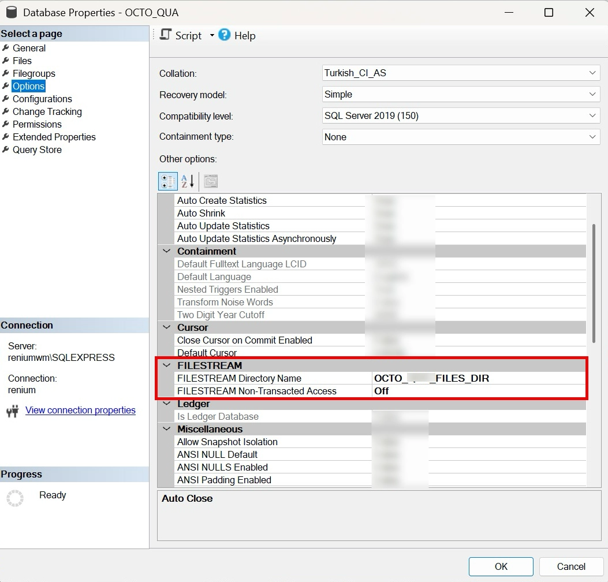
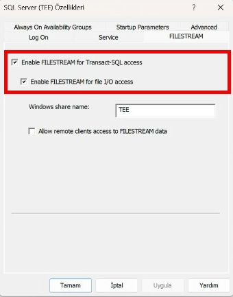
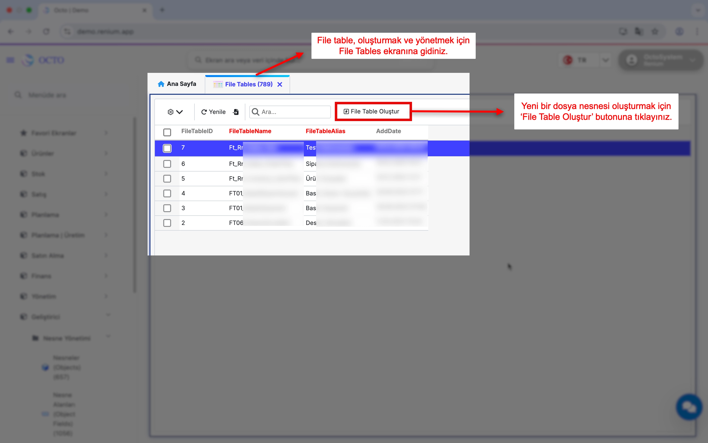
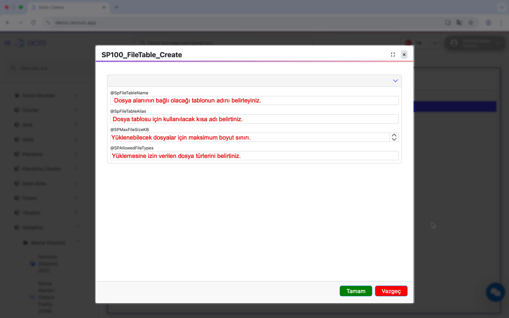
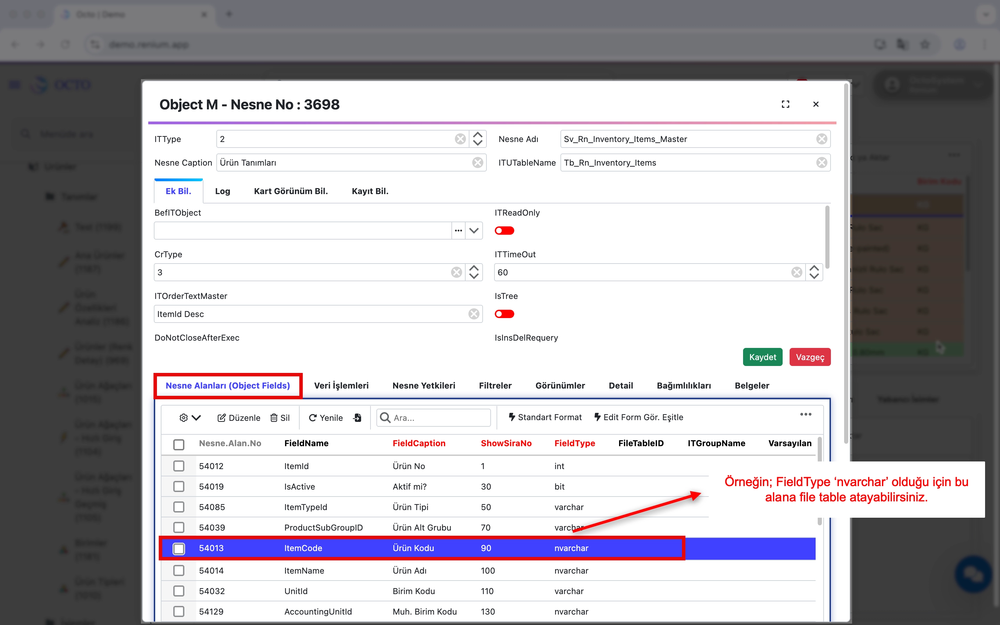
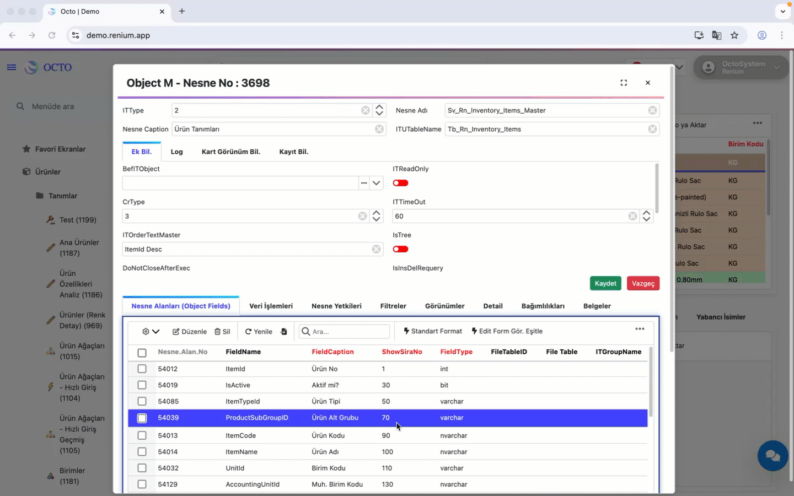

# Dosyalar

Bu bölüm, tablolarınızda **dosya alanlarının** nasıl oluşturulacağını ve sistemde dosya yönetiminin nasıl yapılandırıldığını açıklamaktadır.

## Database Konfigürasyonları

Yeni bir **FileTable** oluşturabilmek için, veritabanınızda **FILESTREAM** ile ilgili bazı ayarların yapılması gerekmektedir. Bu ayarlar, SQL Server üzerinden veritabanı özellikleri ekranından gerçekleştirilir.

### FILESTREAM Directory Name ve Non-Transacted Access Ayarı

1. SQL Server Management Studio (SSMS) üzerinden ilgili veritabanına **sağ tıklayın**.
2. **Properties** (Özellikler) menüsünü açın.
3. Sol menüden **Options** sekmesine gidin.
4. Açılan ekranda **FILESTREAM** başlığı altında yer alan  
   **FILESTREAM Directory Name** alanını bulun.
5. **FILESTREAM Directory Name** alanı, mutlaka veritabanı adını içermelidir.  
Önerilen ve standart kullanım şekli aşağıdaki gibidir:
    ```text
    {DB_NAME}_FILES_DIR
    ```

> **Örnek:**
> Veritabanı adı OCTO_PROD ise:
> ``` OCTO_PROD_FILES_DIR```
> Bu yapılandırma, FILESTREAM dizininin veritabanı ile doğru şekilde ilişkilendirilmesini sağlar.

6. Aynı ekranda yer alan FILESTREAM Non-Transacted Access alanı ise aşağıdaki gibi **Off** olarak yapılandırılmalıdır.

    

> Yapılan değişiklikler sonrasında ayarların geçerli olabilmesi için **OK** butonuna tıklayarak veritabanı özelliklerini kaydetmeniz gerekmektedir.

### Enable FILESTREAM for Transact-SQL Access

FileTable yapısının doğru şekilde çalışabilmesi için, veritabanı ayarlarına ek olarak **SQL Server seviyesinde FILESTREAM erişiminin** de aktif olması gerekmektedir.

Aşağıdaki adımları izleyerek bu ayarı kontrol edebilir ve etkinleştirebilirsiniz:

1. **SQL Server Management Studio (SSMS)** üzerinden ilgili SQL Server instance’ına bağlanın.
2. Sunucuya **sağ tıklayın** ve **Properties** (Özellikler) menüsünü açın.
3. Açılan pencerede **Advanced** sekmesine gidin.
4. **FILESTREAM** başlığı altında yer alan  
   **Enable FILESTREAM for Transact-SQL access** seçeneğinin **işaretli (True)** olduğundan emin olun.

Bu ayar, FILESTREAM verilerine **Transact-SQL (T-SQL)** üzerinden erişilebilmesini sağlar.  
İlgili seçenek aktif değilse, FileTable nesneleri oluşturulamaz veya beklenen şekilde çalışmaz.

    

> Ayar değişikliği yapıldıktan sonra, gerekirse SQL Server servisinin yeniden başlatılması önerilir.

## Dosya Nesnesinin Oluşturulması



Herhangi bir tablonuza **dosya alanı** eklemek için **Geliştirici Modülü → Nesne Yönetimi → FileTables (789)** ekranına gidiniz. Bu ekran üzerinden oluşturmak istediğiniz dosya tablosuna ait temel ayarları yapılandırabilirsiniz.

Yeni bir dosya nesnesi oluşturmak için sağ üstte bulunan **“File Table Oluştur”** butonuna tıklayınız. Açılan formdaki alanları aşağıdaki açıklamalara göre doldurunuz:



---

#### **@SpFileTableName**
Dosya alanının bağlı olacağı tablo adının belirlendiği alandır.

:::tip
Aşağıdaki isimlendirme formatını kullanmanız önerilir:

**Ft_(FirmaKısaKodu)_Modül_İstenilenİsim**

Örneğin: `Ft_Rn_Sales_OrderFiles`

Bu yapı, sistemde standart bir düzen sağlar ve tabloların daha kolay yönetilmesine yardımcı olur.
:::

---

#### **@SpFileTableAlias**
Dosya tablosu için kullanılacak **kısa ad (alias)** bilgisidir.  
Sistem içinde sorgular veya ilişkilerde tabloyu daha anlaşılır biçimde temsil etmek için kullanılır. Genellikle tablo adının mantıklı bir kısaltması tercih edilir.

---

#### **@SPMaxFileSizeKB**
Yüklenebilecek dosyalar için **maksimum boyut sınırının (KB cinsinden)** belirlendiği alandır.  
Bu değer, kullanıcıların sisteme yükleyebileceği en büyük dosya boyutunu kontrol etmeyi sağlar.

---

#### **@SPAllowedFileTypes**
Sisteme yüklenmesine izin verilen **dosya uzantılarını** tanımladığınız alandır.  
**Örnek:**  
`jpg,png,pdf,docx,xlsx`

Bu sayede yalnızca belirlediğiniz türlerdeki dosyaların sisteme yüklenmesine izin verilmiş olur.

---

Bu alanları doldurduktan sonra **Tamam** butonuna tıklayınız. İşlem tamamlandığında oluşturduğunuz **FileTable** listede görüntülenecektir.

> **Not:** Listede yer alan **FileTableID**, dosya alanını farklı tablolara eklerken kullanacağınız kritik bir bilgidir. Bu değeri mutlaka not etmeyi unutmayınız.

---

## Dosya Nesnesinin İlgili Ekranla Bağlantısının Yapılması

Oluşturduğunuz dosya tablosunun bir ekranda kullanılabilmesi için, ilgili ekran ile ilişkilendirme yapmanız gerekir. Bu işlem, ekranda dosya yükleme, görüntüleme ve indirme fonksiyonlarının aktif hale gelmesini sağlar.

Bağlantıyı yapmak için dosya alanını eklemek istediğiniz ekrana gidiniz.  
Ekranın üst kısmında bulunan araç çubuğundan **⚙️ ikonuna** tıklayın ve **“Octo Lab’e Git”** seçeneğini seçin. Bu işlem sizi ekranın yapılandırma (Octo Lab) alanına yönlendirecektir.

Octo Lab ekranında, sayfanın alt bölümünde yer alan **Nesne Alanları** listesinden dosya nesnesiyle ilişkilendirmek istediğiniz alanı bulunuz. 

:::danger[önemli]
Seçtiğiniz nesne alanının **type'ı `nvarchar` olmalıdır.** 
`nvarchar` tipi dışındaki veri tiplerinden oluşmuş alanlar için **file table oluşturamazsınız**.

:::



Ardından araç çubuğundan düzenle butonuna tıkladıktan sonra, **FileTableID** kolonuna, [daha önce oluşturduğunuz](./dosyalar.md#dosya-nesnesinin-oluşturulması) dosya tablosunun **ID değerini** giriniz.

İşlemleri tamamladıktan sonra **Kaydet** butonuna tıklayınız.  
Bu sayede ilgili nesne alanı ile dosya tablosu doğru şekilde ilişkilendirilmiş olur.

---