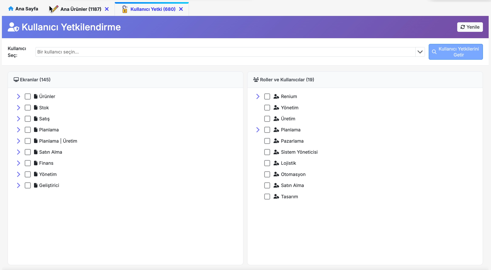

# Ekranlar

**Ekranlar** sayfasında, sistemde tanımlı olan ekranlar ve üst ekranları hiyerarşik bir şekilde listelenir ve buradan bu ekran ve üst ekranları yönetmenizi sağlar. Bu sayfa üzerinden;

- Yeni ekranlar oluşturabilir,
- Mevcut ekranlar üzerinde yetki değişiklikleri yapabilir,
- İhtiyaç duyulmayan ekranları silebilirsiniz.

Tüm ekran yönetimi ve yapılandırma işlemleri bu alandan gerçekleştirilmektedir.

## Yeni Ekran Oluşturma

Yeni bir ekran tanımlamak için sağ üstte bulunan **Yeni Ekran** butonuna tıklayarak *Yeni Ekran Oluşturma* formunu açabilirsiniz. Bu form üzerinden ekranın yapısı, hiyerarşisi ve çalışma şekli belirlenir.

- **Ekran Başlığı**  
  Ekranın sistem genelinde görünecek adını ifade eder.

- **Üst Ekran**  
  Oluşturulacak ekranın, hiyerarşik yapı içerisinde hangi üst ekranın altında yer alacağını belirtir.

- **Ekran Tipi**  
  **Ekran Tipleri**, sistemde farklı ihtiyaçlara yönelik olarak tanımlanmış ekran türleridir. Seçilen **Ekran Tipi**, ekranın hem görsel yapısını hem de fonksiyonel davranışını belirler. Ekranın sahip olacağı özellikler, seçilen ekran tipi esas alınarak otomatik olarak oluşturulur.

1. `MainMenu`
Sistemin **ana menü yapısını** temsil eden ekran tipidir.  
Bu ekran için tanımlanan başlık, üst menüde bölüm adı olarak görüntülenir.  
Genellikle proje veya kurum adının bu alanda kullanılması önerilir.

    

---

2. `Authorization`
Sistem genelinde **yetkilendirme ve erişim yönetiminin** yapıldığı ekran tipidir.  
Kullanıcılar, roller ve erişim izinleri bu ekran üzerinden tanımlanır ve yönetilir.

    

---

3. `Master`

---

4. `MasterDetail`
Master–Multi Detay ekran yapısını temsil eder.  
Bir **Master ekran** ile bir veya birden fazla **Detay ekranın** birlikte çalıştığı yapılardır.  
Ana bir kayda bağlı detay bilgilerin görüntülenmesi ve yönetilmesi amacıyla kullanılır.

    **Örnek:** *Ana Ürünler ekranı*

    

---

5. `Report`

---

6. `Dashboard`

---

7. `SurveyManager`

---

8. `Screen`

---

- **Sıra**
Ekranın, ilgili modül içerisinde hangi sırada görüntüleceğini belirler.

- **Aktiflik**
Aktif olmayan ekranlar menüde görüntülenmez. Ekranın aktif olması için ilgili checkbox işaretlenmelidir. 

- **Nesne**
**Nesne** alanı, ilgili ekranın hangi **veri nesnesi (tablo veya view)** ile çalışacağını belirtir.  
Bu alan sayesinde ekran ile veritabanı arasındaki ilişki kurulmuş olur ve ekranda hangi verilerin listeleneceği, düzenleneceği veya detaylarının görüntüleneceği belirlenir.

:::warning
**Yukarıda belirtilen alanlar, tüm ekran tipleri için tanımlanması zorunlu alanlardır.**
:::

## Ekran Yetkilendirme İşlemleri

Ekranlara ait yetkileri düzenlemek ve organize etmek için **Yetkili Kullanıcılar** sütununu kullanabilirsiniz.  
Yetki düzenlemesi yapmak için, ilgili ekranın **Yetkili Kullanıcılar** sütununda yer alan butona tıklayınız.

Açılan **Yetkilendirme** ekranında;  
- **Yetkili kullanıcılar**  
- **Yetkisiz kullanıcılar**  

iki ayrı liste halinde görüntülenir.

Bir kullanıcının yetkisini kaldırmak veya yeni bir yetki eklemek için, ilgili kullanıcının yanındaki imleci kullanarak **sürükle-bırak** yöntemiyle kullanıcıyı **yetkili** ya da **yetkisiz** listeye taşımanız yeterlidir.

sql server configuraiton
Select sorgusunu yükseltityor 
Sp çalıştığı anda ekrnaın verisini yenile - splerde

exploded from copy - satır kopyalada dahil etme password

value ver itabanına 
popup fields virglle birden fazla alan
index pragmantation - istatistik