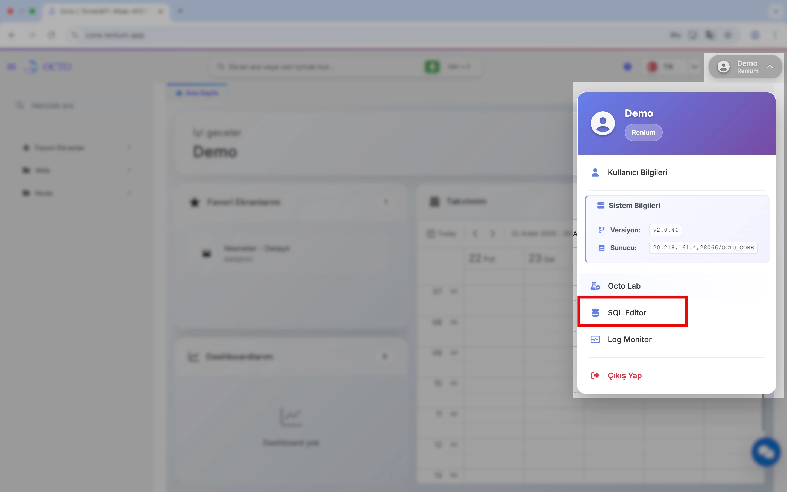
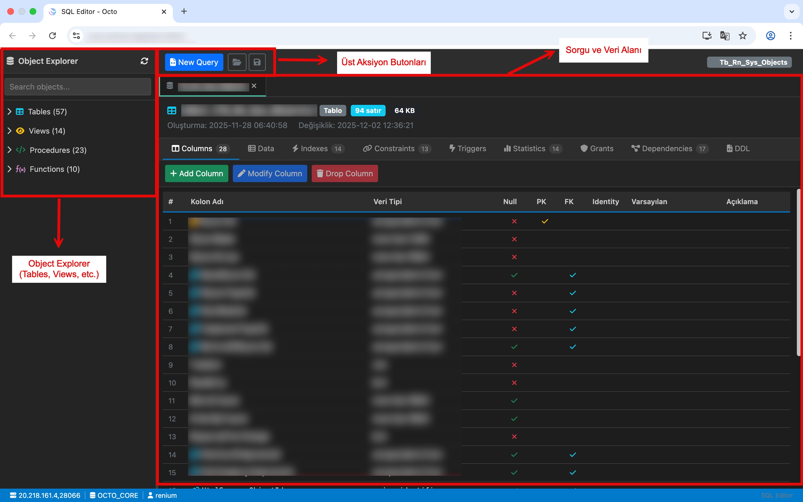
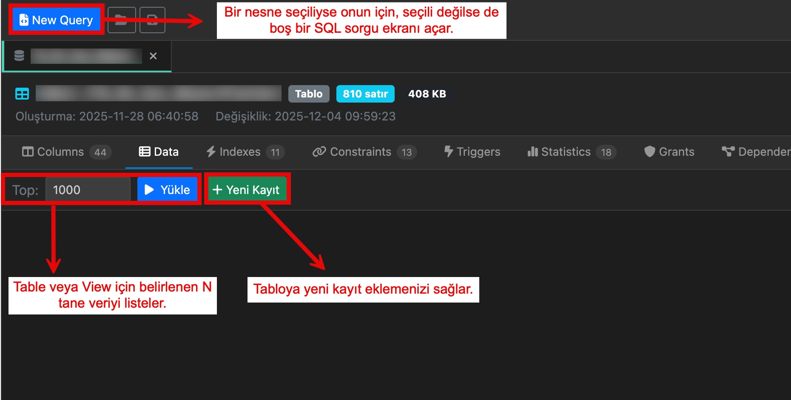

# SQL Editor 

:::danger
SQL Editor ve Object Explorer, doğrudan veritabanı üzerinde işlem yapılmasına olanak tanır.  
Bu nedenle **SQL Editor**, yalnızca **yetkili ve teknik kullanıcılar** tarafından kullanılmalıdır.  
**Roller** sayfasında **Admin** yetkisine sahip olan kullanıcılar için SQL Editor erişimi aktif hale gelir.  
Bu yetkinin nasıl tanımlanacağına dair detaylı bilgiye, **[Yetkilendirme](/docs/octo-web/Yönetim/yetkilendirme)** sayfasının başında yer alan açıklamalardan ulaşabilirsiniz.
:::

Octo içerisinde, sağ üst köşede yer alan **Kullanıcı** menüsünden **SQL Editor** seçildiğinde sistemin dahili SQL Editörü açılır. SQL Editor, yetkili kullanıcıların veritabanı nesneleri üzerinde sorgulama, inceleme ve veri yönetimi yapabilmesi için tasarlanmıştır.

---

## SQL Editor Genel Yapısı

SQL Editor ekranı üç ana bölümden oluşur:

### 1. Object Explorer (Sol Panel)

Object Explorer, veritabanında tanımlı tüm nesnelerin **hiyerarşik olarak listelendiği** alandır. Kullanıcılar buradan veritabanı yapısını inceleyebilir ve ilgili nesnelere hızlıca erişebilir.

Listelenen temel nesne grupları:

- **Tables** – Fiziksel tablolar
- **Views** – Görünümler
- **Procedures** – Saklı yordamlar
- **Functions** – Fonksiyonlar

Her grup genişletilerek altındaki nesneler görüntülenebilir.

---

### 2. Sorgu ve Veri Alanı (Orta Alan)

Object Explorer’dan bir nesne seçildiğinde, orta alanda seçilen nesneye ait detaylar sekmeler halinde görüntülenir:

- **Data**: Tablo veya view verileri
- **Columns**: Kolon adları ve veri tipleri
- **Indexes**: Tanımlı index’ler
- **Constraints**: Primary Key, Foreign Key ve diğer kısıtlar
- **Triggers**: Nesneye bağlı trigger’lar
- **Statistics / Grants**: İstatistik ve yetki bilgileri

Bu alan, kullanıcıların SQL yazmadan nesne yapısını ve içeriğini analiz edebilmesini sağlar.

Ayrıca herhangi bir nesne seçmediğiniz durumda da, yeni query oluşturup çalıştırabileceğiniz alanı gösterir.

---

### 3. Aksiyon Butonları

Seçilen nesneye göre aktif olan aksiyonlar:

- **New Query**  
  Seçili nesne için yeni bir SQL sorgusu başlatır.

- **Yükle**  
  Table veya View için belirlenen **Top N** kadar veriyi listeler.

- **Yeni Kayıt**  
  Yetkili kullanıcıların tabloya yeni kayıt eklemesini sağlar.

- **Düzenleme**  
  Mevcut kayıtların düzenlenmesini aktif veya pasif hale getirir. Düzenlemeyi aktif hale getirdikten sonra kayıtlardaki değerleri değişteribilir yada verileri silebilirsiniz.

  

---

## SQL Editor Üzerinden Yapılabilecek İşlemler

Yetkili kullanıcılar SQL Editor üzerinden aşağıdaki işlemleri gerçekleştirebilir:

- Tablo ve view verilerini görüntüleme
- Veri üzerinde arama ve filtreleme yapma
- Yeni kayıt ekleme
- Mevcut kayıtları düzenleme veya silme
- SQL sorguları çalıştırma
- Tablo ve view yapılarını inceleme
- Index, constraint ve trigger bilgilerini görüntüleme

---

## Object Explorer Kullanımı

Object Explorer, SQL Editor kullanımının başlangıç noktasıdır ve kullanıcıya hızlı navigasyon imkânı sunar.

### Object Explorer Üzerinden Yapılabilecek İşlemler

#### 1. Nesne Arama

Sol panelin üst kısmındaki **Search objects** alanı ile:

- Tablo
- View
- Procedure
- Function  

isimleri hızlıca aranabilir.  
Bu özellik, nesne sayısının fazla olduğu veritabanlarında hızlı erişim sağlar.

---

#### 2. Nesne Seçme ve Detay İnceleme

Object Explorer’dan bir nesne seçildiğinde:

- Sağ panelde ilgili nesnenin detay ekranı açılır
- Varsayılan olarak **Data**, **Columns**, **Indexes**, **Constraints** gibi sekmeler görüntülenir

Örnek:
- Bir **Table** seçildiğinde kolonlar ve tablo verileri görüntülenir
- Bir **View** seçildiğinde view çıktısı listelenir

---

#### 3. Veri Listeleme

Table veya View seçildikten sonra:

- **Yükle** butonu ile veri getirilebilir
- Veriler grid formatında görüntülenir
- Kolon bazlı inceleme yapılabilir

---

#### 4. Kayıt İşlemleri

- **Yeni Kayıt** ile tabloya veri eklenebilir
- Mevcut kayıtlar düzenlenebilir veya silinebilir

> Kayıt ekleme ve düzenleme işlemleri kullanıcının rol ve yetkilerine bağlıdır.

---

#### 5. Nesne Yapısını İnceleme

Object Explorer üzerinden aşağıdaki yapılar SQL yazmadan görüntülenebilir:

- Kolon isimleri ve veri tipleri
- Primary Key ve Foreign Key tanımları
- Index bilgileri
- Constraint ve Trigger tanımları

---

#### 6. SQL Editor ile Entegrasyon

Object Explorer, SQL Editor ile entegre çalışır:

- Seçilen nesne üzerinden **New Query** başlatılabilir
- Kullanıcı, ilgili tablo veya view için doğrudan SQL sorgusu yazabilir
