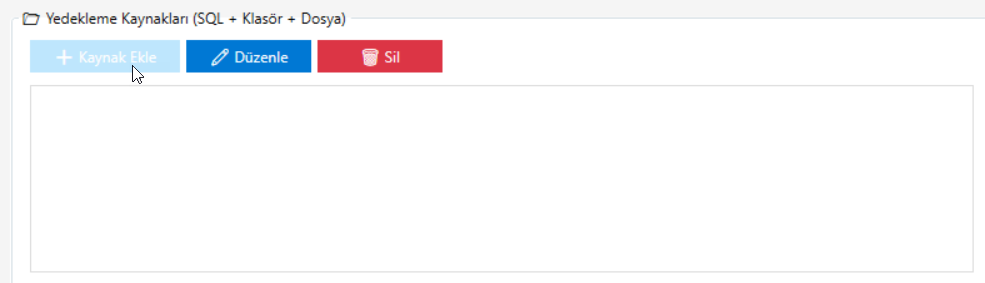
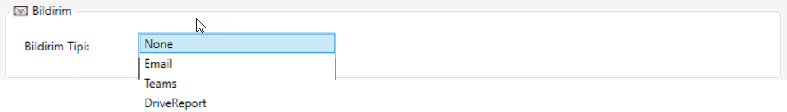

# Görev Yönetimi

Ana ekrandan yedekleme görevleriniz üzerinde aşağıdaki işlemleri yapabilir, aktif görevleri ve görevlerin çalışma geçmişini görüntüleyeblirsiniz.

- **Yeni Görev**:
 Yeni bir yedekleme görevi oluşturun
- **Düzenle**: Mevcut görevi düzenleyin
- **Sil**: Görevi kaldırın
- **Şimdi Çalıştır**: Görevi anında başlatın
- **Görev Zamanlayıcı**: Windows Görev Zamanlayıcı'yı açın 
- **Yenile**: Görev listesini yenileyin

## Yeni Görev

### Görev Adı*

Yedekleme görevine benzersiz ve açıklayıcı bir isim verin. Bu isim, görev listesinde ve raporlarda görev tanımlamak için kullanılır.
:::tip **Örnek**

"Günlük Veritabanı Yedeği", "Haftalık Dosya Yedekleme"

:::

### Yedekleme Kaynakları*

Yedekleme yapılacak kaynakları ekleyin ve yapılandırın. SQL veritabanları, klasörler veya dosyalar seçebilirsiniz.
 
Birden fazla kaynak ekleyebilir ve hepsini aynı görevde yedekleyebilirsiniz. Aşağıdaki bilgiler ile kaynak eklenir ve düzenlenir. daha sonra silinebilir.

- **Kaynak Adı**: Kaynağı tanımlayıcı bir isim verin. Veri tabanı, klasör, dosya adı verilmesi tavsiye edilir. 
- **Yedekleme Tipi**: Kaynak türünü seçin
  - **Folder**: Klasör yedeklemesi
    - **Yol**: Yedeklenecek klasörün tam yolunu girin veya seçin
  - **File**: Tek dosya yedeklemesi
  - **Veri tabanı (Sql Server)**: SQL Server veritabanı yedeklemesi
    - **Server Bilgileri**: Yedeklenecek veri tabanın server bilgileri girilir.

### Hedef ve Zip*

Yedekleme dosyalarının kaydedileceği hedef klasörü belirleyin.

**Hedef Klasör**: Yedekleme dosyalarının saklanacağı klasör yolunu girin veya **...** butonuyla klasör seçin.
- Yerel bir klasör olabilir: `C:\Backups`
- Ağ paylaşımı olabilir: `\\server\backups\`

:::tip **Örnek**

 `C:\Yedek`, `D:\Backups\Daily`, `\\192.168.1.10\yedekler`
:::

**Dosya Şablonu**: Yedek dosyasının adını belirleyen şablon.

Varsayılan format: `{job}_{yyyyMMdd_HHmmss}.zip` şeklindedir.

**Kullanılabilir Değişkenler**:
- `{job}`: Görev adı
- `{yyyy}`: Yıl (4 haneli)
- `{MM}`: Ay (2 haneli)
- `{dd}`: Gün (2 haneli)
- `{HH}`: Saat (24 saat formatı)
- `{mm}`: Dakika
- `{ss}`: Saniye

:::tip **Örnek Şablonlar**

- `{job}_{yyyyMMdd_HHmmss}.zip` → `MuhasebeYedek_20251106_143025.zip`
- `Backup_{yyyy}-{MM}-{dd}.zip` → `Backup_2025-11-06.zip`
- `{job}_{yyyyMMdd}.zip` → `VeriTabani_20251106.zip`

:::
**ZIP Oluştur**: Bu seçenek işaretlendiğinde, yedekleme dosyaları sıkıştırılarak ZIP formatında kaydedilir. Bu sayede disk alanı tasarrufu sağlanır.

### Bulut Yükleme

**rclone Remote**: Önceden yapılandırılmış rclone remote adını girin.

- Rclone yapılandırmasında tanımladığınız remote ismi olmalıdır
- Örnek: `mega:`, `gdrive:`, `onedrive:`, `s3:`
- Remote yapılandırması için rclone dokümantasyonuna bakınız

**Uyarı**: Remote admin sonuna `:` eklemeyi unutmayın (örn: `mega:`, `gdrive:`)
 
**Remote Klasör**: Buluttaki hedef klasör yolunu belirleyin.

- Yedekleme dosyalarının bulutta kaydedileceği klasör
- Örnek: `/ReniumBackup`, `/Backups/Daily`
- Klasör yoksa otomatik oluşturulur
 
**Bulut Saklama**: Eski yedekleme dosyalarının bulutta ne kadar süre saklanacağını belirleyin.

- **Gün** cinsinden süre belirleyin
- Bu günden eski yedekler buluttan otomatik silinir
- **0** değeri: Temizleme yapma (tüm yedekler saklanır)
- Örnek: `3` gün → Bu günden eski yedekler silinir

:::tip

Disk alanı tasarrufu için eski yedeklerin **düzenli olarak temizlenmesi** önerilir.

**Buluta yükleme yapmak istemiyorsanız rclone Remote alanını boş bırakın.**
Bu durumda yedekleme sadece yerel hedef klasöre kaydedilir.
:::

### Bildirim

Görev tamamlandığında bildirim almak için farklı kanallar seçebilirsiniz:

#### Email Bildirimi

- **E-Posta**: Bildirimin gönderileceği e-posta adresini girin
- **Konu Şablonu**: E-posta konusunu özelleştirin. Varsayılan format "Yedekleme: [Görev Adı]" şeklindedir

#### Teams Bildirimi

- Microsoft Teams üzerinden bildirim almak için webhook URL'si yapılandırın
- Görev durumu ve sonuçları Teams kanalına otomatik olarak gönderilir.

#### DriveReport Bildirimi

...
 
### Zamanlama

Görevin ne zaman ve ne sıklıkla çalışacağını belirleyin. Windows Görev Zamanlayıcı kullanılarak otomatik yedekleme yapılır.

#### Tetikleyici Türü

Açılır menüden görevin çalışma sıklığını seçin:

- **Once (Bir Kez)**: Görev yalnızca bir kez çalışır

- **Daily (Günlük)**: Her gün belirtilen saatte çalışır
  - **Saat (HH:mm)**: Görevin çalışacağı saati belirleyin (örn: 02:00)

- **Weekly (Haftalık)**: Haftanın belirli günlerinde çalışır
  - **Gün Seçimi**: Haftanın hangi günlerinde çalışacağını seçin (Pazartesi, Salı, vb.)
  - **Saat (HH:mm)**: Görevin çalışacağı saati belirleyin

- **Monthly (Aylık)**: Ayın belirli günlerinde çalışır
  - **Gün**: Ayın hangi gününde çalışacağını belirleyin (1-31 arası)
  - **Saat (HH:mm)**: Görevin çalışacağı saati belirleyin

- **Hourly (Saatlik)**: Her saat başı otomatik olarak çalışır

- **EveryNMinutes (Her N Dakikada)**: Belirtilen dakika aralıklarında çalışır
  - **Dakika Aralığı**: Kurulum saatinden itibaren kaç dakikada bir çalışacağını belirleyin
  - Örnek: 15 dakika seçilirse, görev her 15 dakikada bir çalışır

:::tip

Seçilen zamanlama ayarlarına göre özet bilgi ekranın alt kısmında yeşil kutuda görüntülenir.

:::

## Düzenle

Mevcut bir yedekleme görevini düzenlemek için:

1. Görev listesinden düzenlemek istediğiniz görevi seçin
2. **Düzenle** butonuna tıklayın
3. Görev ayarlarını güncelleyin
4. **Kaydet** butonuna tıklayarak değişiklikleri uygulayın

:::info

Görev düzenlendiğinde, Windows Görev Zamanlayıcı otomatik olarak güncellenir.

:::

## Sil

Bir yedekleme görevini silmek için:

1. Görev listesinden silmek istediğiniz görevi seçin
2. **Sil** butonuna tıklayın
3. Silme işlemini onaylayın

:::warning
- Görev silindiğinde, Windows Görev Zamanlayıcı'dan da kaldırılır
- Bu işlem geri alınamaz
- Daha önce oluşturulmuş yedekleme dosyaları silinmez
:::

## Şimdi Çalıştır

Zamanlanmış görevleri beklemeden manuel olarak çalıştırabilirsiniz:

1. Görev listesinden çalıştırmak istediğiniz görevi seçin
2. **Şimdi Çalıştır** butonuna tıklayın
3. Görev anında başlatılır ve ilerleme çubuğunda durum gösterilir

**Kullanım Senaryoları**:
- Acil yedekleme ihtiyacı
- Zamanlama öncesi test yapma
- Sistem bakımı öncesi ekstra yedek alma
