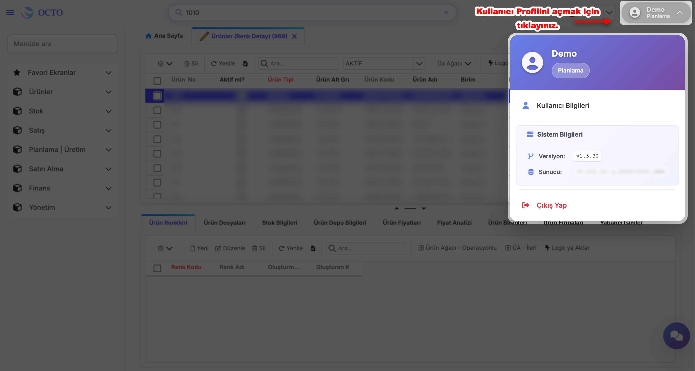
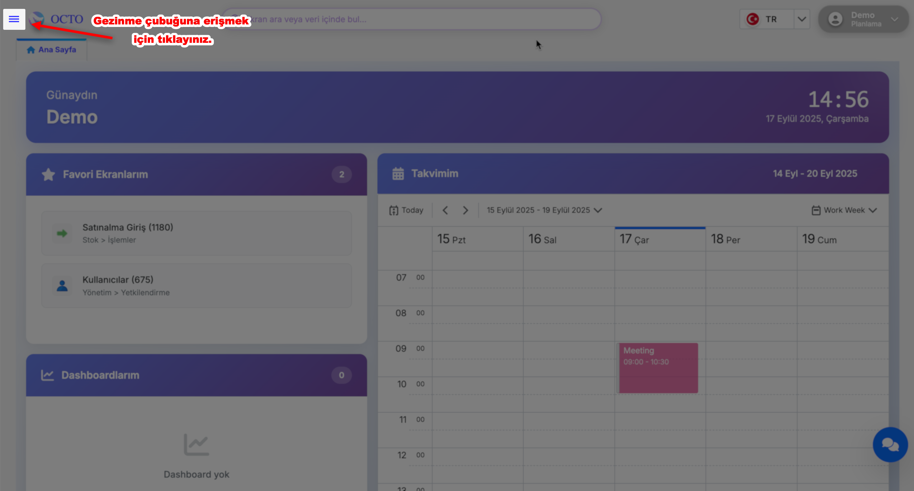
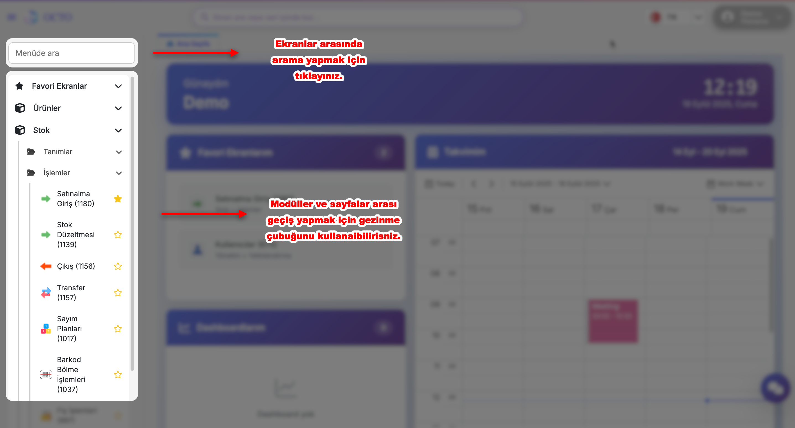

# Genel Kullanım

Bu bölümde, programın temel özelliklerini, arayüzün nasıl kullanılacağını ve programdan en iyi şekilde nasıl yararlanabileceğinizi adım adım öğreneceksiniz.

Programın ana ekranından başlayarak, sık kullanılan özellikler, ayarlar menüsü, dosya yönetimi ve daha fazlası gibi temel bölümler detaylı bir şekilde anlatılacaktır. Ekran görüntüleri ve ipuçları ile desteklenen bu rehber, programı daha verimli kullanmanız için pratik bilgiler sağlar.

## Anasayfa

Ana Sayfa, Octo Web Platformu’na giriş yaptıktan sonra karşılaşacağınız ilk ekrandır. Buradan platformun tüm özelliklerine kolayca ulaşabilir ve hızlıca yönetebilirsiniz.

Ana sayfada görebileceğiniz başlıca bölümler:

- **Dashboard:** Projelerinizin genel durumunu ve özet bilgileri tek ekranda takip edin.
- **Takviminiz:** Toplantılarınızı, etkinliklerinizi ve önemli tarihleri düzenli şekilde görüntüleyin.
- **Favori Ekranlarınız:** Sık kullandığınız sayfaları favorilere ekleyerek kolay erişim sağlayın.
- **Arama Çubuğu** 
- **Kullanıcı Profili**

---

### Dashboard

Dashboardlar, Octo Web platformunun ana sayfasında yer alan ve kullanıcıya hızlı bir genel bakış sağlayan bölümüdür. Burada belirlediğiniz ekranlar ile ilgili kritik bilgileri özet halinde görüntüleyebilirsiniz.

:::warning
Dashboardlar her müşteriye özel olarak hazırlanır bu yüzde hesabınızda dashboard oluşması için ekibimizle iletişime geçmeniz gerekmektedir. İletişime geçilmediği sürece hesabınızda herhangi bir dashboard belirmeyecektir.
:::

---

### Takviminiz

Takviminiz, günlük toplantılarınızı düzenlemenizi ve yönetmenizi sağlar. Daha önce oluşturduğunuz toplantıları burada görebilir veya yeni toplantılar ekleyebilirsiniz.

#### *Yeni Toplantı Oluşturma*

1. Takvimde istediğiniz tarihe gidin ve toplantıyı eklemek istediğiniz saat aralığına tıklayın.

2. Açılan pop-up ekranında toplantı ile ilgili bilgileri doldurun:
    - ***Subject:*** Toplantının başlığı veya konusu
    - ***Start/End:*** Toplantının başlangıç ve bitiş tarihi/saati
    - ***Repeat:*** Gerekirse toplantının tekrar sıklığı
    - ***Location:*** Toplantının yapılacağı yer veya link
    - ***Label:*** Toplantılarınızı kategorize etmek için kullanbilirsiniz
    - ***Status:*** Toplantı zamanındaki uygunluk durumunuzu belirtebilirsiniz
    - ***Description:*** Toplantı ile ilgili ek bilgiler veya notlar

3. Bilgileri girip kontrol ettikten sonra etkinliğinizi kaydetmek için pop-up ekranının sağ üst köşesinde bulunan **Save** butonuna, iptal etmek içinse **Discard** butonuna tıkalyınız.

4. Save butonuna tıkladıktan sonra, takvimde ilgili tarih ve saatte etkinliğiniz görünür hale gelir.

:::note

Takviminiz bölümüne eklediğiniz etkinlikler yada toplantılar size toplantılarınızı gerçekleştirmeniz için canlı bir ortam sunmaz, sadece bunları not etmenizi sağlar.

:::

---

### Favori Ekranlarınız

Favori Ekranlarınız, sık kullandığınız ve hızlı erişmek istediğiniz servis sayfalarına tek tıklamayla ulaşmanızı sağlar.

#### *Favori Ekran Ekleme*

1. Anasayfanın sol üst köşesinde bulunan gezinme çubuğunu açın.
2. Favoriye eklemek istediğiniz ekranın bulunduğu dizine gidin.
3. Gezinme çubuğunda ilgili ekranın yanında bulunan yıldız (⭐️) ikonuna tıklayın. Bu işlem ekranı favori listenize ekler.

#### *Favori Ekrandan Çıkarma*

Daha önce eklediğiniz bir ekranı favorilerinizden çıkarmak için, tekrar ilgili ekranın bulunduğu dizine gezinme çubuğu içinde gidin ve yıldız (⭐️) ikonuna tıklayın. Bu işlem ekranı favori listenizden kaldırır.

#### *Favori Ekranlarınıza Erişim*

Eklediğiniz veya çıkardığınız ekranlar, **Ana Sayfa > Favori Ekranlarım** bölümünde görüntülenir.
Alternatif olarak, **Gezinme Çubuğu’nu** açıp en üstte bulunan **Favori Ekranlar** bölümüne tıklayarak da favori ekranlarınıza ulaşabilirsiniz.

  

  
**Resimli yönlendirmeler için tıklayınız.**

  

  

---

### Arama Çubuğu

Arama çubuğuna tıkladığınızda, aramak istediğiniz ekranın adını veya veriyi yazabilirsiniz. Doğrudan ilgili ekranların veya verilerin bulunduğu sayfalar listelenir, böylece ihtiyaç duyduğunuz bilgilere hızlı ve kolay bir şekilde ulaşabilirsiniz.

:::tip
Gezinme Menüsü’ndeki arama fonksiyonuna ek olarak, Arama Çubuğu **hem ekranlar hem de veriler** için arama yapmanızı sağlar. 
:::

---

### Kullanıcı Profili

**Kullanıcı Profili**, ana sayfanın sağ üst köşesinde yer alan kullanıcı adınıza tıklayarak açabileceğiniz bir menüdür. Menü üç bölümden oluşur:

**Resimli yönlendirmeler için tıklayınız.**

**1. Kullanıcı Bilgileri:**
- Bu butona tıkladığınızda anasayfanızda Kullanıcı Bilgileri sekmesi açılır.
- Sekme içinde hesabınızla ilgili detayları görebilir ve güncelleyebilirsiniz:
  - **Profil Fotoğrafı:** Mevcut fotoğrafınızı görebilir ve _Select File_ ile yeni bir fotoğraf yükleyebilirsiniz.
  - **Kullanıcı Bilgileri:** Hesap adınız ve sistemde hangi rolde bulunduğunuzu görebilirsiniz.
  - **Parola Bilgileri:** Parola değişikliğinizi bu alanda yapabilirsiniz.

**2. Sistem Bilgileri:** Platformun **versiyonu ve sunucu bilgileri** gibi teknik detayları görüntüleyebilirsiniz.

**3. Çıkış Yap:** Hesabınızdan güvenli bir şekilde çıkış yapmak için bu butona tıklayınız.

-----

## Menüler

### Sol Menü

Sol Menü, ekranın sol üst köşesinde bulunan **≡** sembolüne tıklayarak açılıp kapatılabilir. Bu menü sayessinde platform içindeki modül ve modül alt gruplarını görüntüleyebilir ve hızlıca erişebilirsiniz.

**Modül:**
- Benzer fonksiyonlara sahip ekranları gruplandırmak için kullanılır.
- ERP sistemlerinde bazı yaygın modüller şunlardır:
    * Ürünler
    * Stok
    * Satış
    * Planlama
    * Üretim vb.

**Modül Alt Grup:**
- Modül içinde belirli bir işlevi daha da detaylı bir şekilde yönetmek için ayrılmış daha küçük gruplardır. Ekran sayısının çok olduğu modüllerde istenen ekranlara ulaşımı kolaylaştırmak için kullanılabilmektedir.

:::warning
Kullanıcılar; sol menüde yetkisi olduğu ekran, modül ve modül alt grupları görebilmektedir. Bu sebeple sol menü kullanıcıların yetkisine göre değişiklik göstermektedir.
:::

  

  
**Resimli yönlendirmeler için tıklayınız.**

  

  

- Menü açıldıktan sonra beliren Menüde Ara fonksiyonunu kullanarak istediğiniz ekranı hızlıca bulabilirsiniz.
- Menüde listelenen başlıklara tıklayarak farklı modüllere veya sayfalara geçiş yapabilirsiniz.

    :::tip
    Modül ve Modül Alt Gruplarının yanında bulunan numaralar da o ekranlara ait numaralardır. Ekran araması yaparken ismiyle yada bu numarayla arayabilirsiniz.
    :::

    

    
**Resimli yönlendirmeler için tıklayınız.**

    

    

---

## Ekran Özellikleri

Ekran yapısı tablo (grid) biçiminde, görüntü ve fonksiyon olarak excel' e oldukça benzemektedir. Ekran yapısı sırasıyla üst kısmında araç çubuğu, alan başlıkları,  yeni kayıt ekleme satırı ve verilerden oluşturmaktadır.

Ekranlar genel olarak aşağıdaki özelliklere sahiptir;

* Araç Çubuğu
  * [Kayıt İşlemleri](./#kayit-islemleri)
  * [Veri İşlemleri](./)
  * Rapor İşlemleri
* Tablo (Grid) Özellikleri
  * [Filtreleme](./#filtreleme)
  * [Gruplama](./#gruplama)
  * [Özet bandı](./#oezet-bandi)
  * [Görünüm oluşturma](./#goeruenuemler)

**Resimli yönlendirmeler için tıklayınız.**

### Sadece Okunabilir Ekran

Standart olarak yeni veri girişi yapabildiğiniz ekranlarda bunun için 'Yeni' alanı bulunur fakat, bu alanın olmadığı ekranlar da bulunmaktadır. Bu ekranlar Sadece Okunabilir (Read Only) Ekranlardır. Bu tür ekranlarda ekleme ve güncelleme işlemi yapılamaz. 

**Resimli yönlendirmeler için tıklayınız.**

### Master - Master Detay Ekranları

Bir ekranın içinde iki tablonun bulunduğu ekran çeşidi Master-Detay ekran olarak adlandırılır ve resimdeki gibidir. Burada ikinci tablo ilk tabloda seçili kaydın bağlantılı detay kayıtlarını gösterir.

-- Örn; Resimdeki mamul ürün ekranında mamul ürün bilgileri 1. tablo yer alır. Seçili 866 nolu ürünün ham maddeleri ikinci tabloda yer almaktadır. Bu örnekte tanımlı ham maddesi olmadığı anlaşılmaktadır. --

**Resimli yönlendirmeler için tıklayınız.**

- Ekranlar sekme olarak açılmaktadır ve sekme bölümü üzerinden dolaşılabilmektedir. Sekme üzerinde sağ tıkladıktan sonra açılan menü ile ilgili işlemler yapılabilmektedir.

**Resimli yönlendirmeler için tıklayınız.**

---

## Veri İşlemleri

### Yeni Kayıt Ekleme
Kayıt ekleme, ilgili modül alt sayfalarındaki **Yeni** tuşuna tıklanarak yapılabilmektedir. 

Yeni kayıt eklemesi yapılırken;
- Alanın **Kırmızı** renk olması zorunlu olduğunu ifade eder. Bu tip alanlar doldurulmadan veri girişi yapılamaz.
- **Gri** renk olması alanın sadece okunabilir (read only) olduğunu ifade eder.
- **Siyah** renk olması isteğe bağlı doldurulması gereken doldurulması zorunluluk gerektirmeyen alanlardır.

**Resimli yönlendirmeler için tıklayınız.**

- Bazı alanlar sadece kütüphane de tanımlı alanlardaki değeri alabilir. Bu tür alanlarda **(↓)** işareti görünmektedir. Bu işarete tıklayarak tanımlı değerlerden birini seçebilirsiniz.

**Resimli yönlendirmeler için tıklayınız.**

- Alan üzerinde görünen alt ok sembolü tıklanarak kütüphane listelenebilir.
- Listeleme ekranında anahtar sözcükler yazılarak filtreleme işlemi yapılabilir.
- Aynı alanın yanında bulunan **üç nokta (...)** tuşuna tıklanarak kütüphanenin kaynak ekranına gidilebilir. Kütüphaneye yeni kayıt eklenmek istenirse açılan ekranda yeni kayıt eklenebilir.

**Resimli yönlendirmeler için tıklayınız.**

- Benzer özellikli kayıtlar eklemek için satır kopyalama özelliği kullanılabilir. 
    - Bir satırı kopyalamak için, öncelikle kopyalamak istediğiniz satırın yanındaki **checkbox**’ı işaretleyin.
    - Ardından satırın üzerine **sağ tıklayın**. Açılan menüden **“Satırı Kopyala”** seçeneğini seçtiğinizde, ilgili satır otomatik olarak **yeni kayıt ekleme ekranı**nda açılacaktır. Burada gerekli değişiklikleri yaptıktan sonra **Kaydet** butonuna tıklayarak yeni kaydınızı oluşturabilirsiniz.

*Kayıt işlemleri sırasında çeşitli hata veya uyarılar alınabilir. Bu tür durumlarda işlemler tamamlanmayacaktır. Uyarı alınmıyorsa işlem başarılı bir şekilde gerçekleşmiş anlamına gelir.*

### Kayıt Güncelleme

Kayıt güncelleme, ekrandaki veriler üzerinde aşağıda belirtilen adımlara ve kurallara dikkat edilerek yapılmaktadır.

1. İlgili kaydın en solunda bulunan **checkbox**'ı işaretleyip ilgili satırı seçiniz. 
2. Daha sonrasında araç çubuğunda bulunan **"Güncelle"** butonuna tıklayınız.
3. Açılan ekranda, satırla ilgili detayları görüntüleyebilir ve istediğiniz alanları değiştirebilirsiniz. 

Gerekli değişiklikleri yaptıktan sonra **"Kaydet"** tuşuna tıklayarak veriyi güncelleyebilirsiniz.

### Kayıt Silme

İlgili kaydın en solunda bulunan **checkbox**'ı işaretleyip ilgili satırı seçtikten sonra araç çubuğundaki **Sil** butonuna tıklayınız. 

#### Çoklu Kayıt Silme

Çoklu silme işlemi yapmak için, birden fazla satırın **checkbox**'ını seçip araç çubuğundan sil butonuna tıklayabilirsiniz.