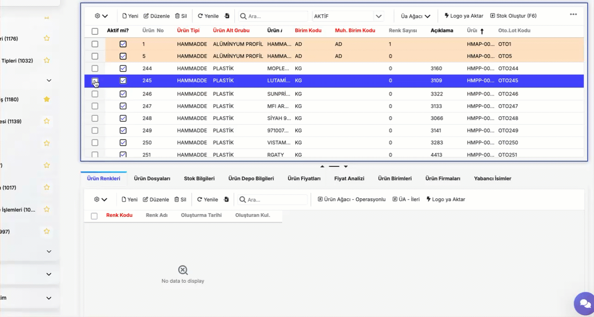
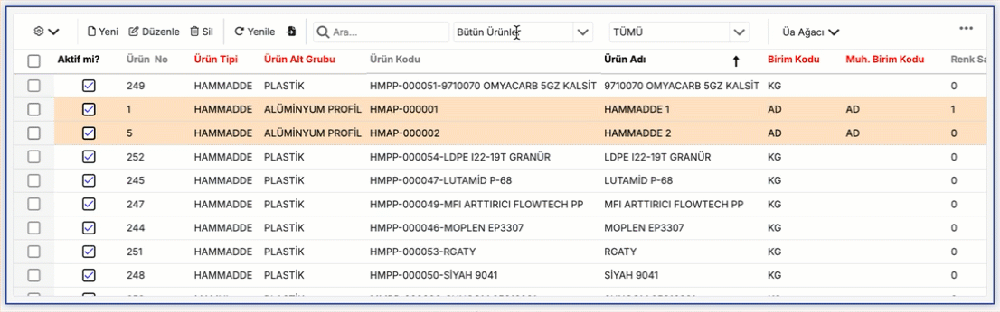

# Genel Kullanım

Bu bölümde, programın temel özelliklerini, arayüzün nasıl kullanılacağını ve programdan en iyi şekilde nasıl yararlanabileceğinizi adım adım öğreneceksiniz.

Programın ana ekranından başlayarak, sık kullanılan özellikler, ayarlar menüsü, dosya yönetimi ve daha fazlası gibi temel bölümler detaylı bir şekilde anlatılacaktır. Ekran görüntüleri ve ipuçları ile desteklenen bu rehber, programı daha verimli kullanmanız için pratik bilgiler sağlar.

## Anasayfa

Ana Sayfa, Octo Web Platformu’na giriş yaptıktan sonra karşılaşacağınız ilk ekrandır. Buradan platformun tüm özelliklerine kolayca ulaşabilir ve hızlıca yönetebilirsiniz.

Ana sayfada görebileceğiniz başlıca bölümler:

- **Dashboard:** Projelerinizin genel durumunu ve özet bilgileri tek ekranda takip edin.
- **Takviminiz:** Toplantılarınızı, etkinliklerinizi ve önemli tarihleri düzenli şekilde görüntüleyin.
- **Favori Ekranlarınız:** Sık kullandığınız sayfaları favorilere ekleyerek kolay erişim sağlayın.
- **Arama Çubuğu** 
- **Kullanıcı Profili**

---

### Dashboard

Dashboardlar, Octo Web platformunun ana sayfasında yer alan ve kullanıcıya hızlı bir genel bakış sağlayan bölümüdür. Burada belirlediğiniz ekranlar ile ilgili kritik bilgileri özet halinde görüntüleyebilirsiniz.

:::warning
Dashboardlar her müşteriye özel olarak hazırlanır bu yüzde hesabınızda dashboard oluşması için ekibimizle iletişime geçmeniz gerekmektedir. İletişime geçilmediği sürece hesabınızda herhangi bir dashboard belirmeyecektir.
:::

---

### Takviminiz

Takviminiz, günlük toplantılarınızı düzenlemenizi ve yönetmenizi sağlar. Daha önce oluşturduğunuz toplantıları burada görebilir veya yeni toplantılar ekleyebilirsiniz.

#### *Yeni Toplantı Oluşturma*

1. Takvimde istediğiniz tarihe gidin ve toplantıyı eklemek istediğiniz saat aralığına tıklayın.

2. Açılan pop-up ekranında toplantı ile ilgili bilgileri doldurun:
    - ***Subject:*** Toplantının başlığı veya konusu
    - ***Start/End:*** Toplantının başlangıç ve bitiş tarihi/saati
    - ***Repeat:*** Gerekirse toplantının tekrar sıklığı
    - ***Location:*** Toplantının yapılacağı yer veya link
    - ***Label:*** Toplantılarınızı kategorize etmek için kullanbilirsiniz
    - ***Status:*** Toplantı zamanındaki uygunluk durumunuzu belirtebilirsiniz
    - ***Description:*** Toplantı ile ilgili ek bilgiler veya notlar

3. Bilgileri girip kontrol ettikten sonra etkinliğinizi kaydetmek için pop-up ekranının sağ üst köşesinde bulunan **Save** butonuna, iptal etmek içinse **Discard** butonuna tıkalyınız.

4. Save butonuna tıkladıktan sonra, takvimde ilgili tarih ve saatte etkinliğiniz görünür hale gelir.

:::note

Takviminiz bölümüne eklediğiniz etkinlikler yada toplantılar size toplantılarınızı gerçekleştirmeniz için canlı bir ortam sunmaz, sadece bunları not etmenizi sağlar.

:::

---

### Favori Ekranlarınız

Favori Ekranlarınız, sık kullandığınız ve hızlı erişmek istediğiniz servis sayfalarına tek tıklamayla ulaşmanızı sağlar.

#### *Favori Ekran Ekleme*

1. Anasayfanın sol üst köşesinde bulunan gezinme çubuğunu açın.
2. Favoriye eklemek istediğiniz ekranın bulunduğu dizine gidin.
3. Gezinme çubuğunda ilgili ekranın yanında bulunan yıldız (⭐️) ikonuna tıklayın. Bu işlem ekranı favori listenize ekler.

#### *Favori Ekrandan Çıkarma*

Daha önce eklediğiniz bir ekranı favorilerinizden çıkarmak için, tekrar ilgili ekranın bulunduğu dizine gezinme çubuğu içinde gidin ve yıldız (⭐️) ikonuna tıklayın. Bu işlem ekranı favori listenizden kaldırır.

#### *Favori Ekranlarınıza Erişim*

Eklediğiniz veya çıkardığınız ekranlar, **Ana Sayfa > Favori Ekranlarım** bölümünde görüntülenir.
Alternatif olarak, **Gezinme Çubuğu’nu** açıp en üstte bulunan **Favori Ekranlar** bölümüne tıklayarak da favori ekranlarınıza ulaşabilirsiniz.

  

  
**Resimli yönlendirmeler için tıklayınız.**

  

  

---

### Arama Çubuğu

Arama çubuğuna tıkladığınızda, aramak istediğiniz ekranın adını veya veriyi yazabilirsiniz. Doğrudan ilgili ekranların veya verilerin bulunduğu sayfalar listelenir, böylece ihtiyaç duyduğunuz bilgilere hızlı ve kolay bir şekilde ulaşabilirsiniz.

:::tip
Gezinme Menüsü’ndeki arama fonksiyonuna ek olarak, Arama Çubuğu **hem ekranlar hem de veriler** için arama yapmanızı sağlar. 
:::

---

### Kullanıcı Profili

**Kullanıcı Profili**, ana sayfanın sağ üst köşesinde yer alan kullanıcı adınıza tıklayarak açabileceğiniz bir menüdür. Menü üç bölümden oluşur:

**Resimli yönlendirmeler için tıklayınız.**

**1. Kullanıcı Bilgileri:**
- Bu butona tıkladığınızda anasayfanızda Kullanıcı Bilgileri sekmesi açılır.
- Sekme içinde hesabınızla ilgili detayları görebilir ve güncelleyebilirsiniz:
  - **Profil Fotoğrafı:** Mevcut fotoğrafınızı görebilir ve _Select File_ ile yeni bir fotoğraf yükleyebilirsiniz.
  - **Kullanıcı Bilgileri:** Hesap adınız ve sistemde hangi rolde bulunduğunuzu görebilirsiniz.
  - **Parola Bilgileri:** Parola değişikliğinizi bu alanda yapabilirsiniz.

**2. Sistem Bilgileri:** Platformun **versiyonu ve sunucu bilgileri** gibi teknik detayları görüntüleyebilirsiniz.

**3. Çıkış Yap:** Hesabınızdan güvenli bir şekilde çıkış yapmak için bu butona tıklayınız.

-----

## Menüler

### Sol Menü

Sol Menü, ekranın sol üst köşesinde bulunan **≡** sembolüne tıklayarak açılıp kapatılabilir. Bu menü sayesinde platform içindeki modül ve modül alt gruplarını görüntüleyebilir ve hızlıca erişebilirsiniz.

  

  
**Resimli yönlendirmeler için tıklayınız.**

  

  

**Modül:**
- Benzer fonksiyonlara sahip ekranları gruplandırmak için kullanılır.
- ERP sistemlerinde bazı yaygın modüller şunlardır:
    * Ürünler
    * Stok
    * Satış
    * Planlama
    * Üretim vb.

**Modül Alt Grup:**
- Modül içinde belirli bir işlevi daha da detaylı bir şekilde yönetmek için ayrılmış daha küçük gruplardır. Ekran sayısının çok olduğu modüllerde istenen ekranlara ulaşımı kolaylaştırmak için kullanılabilmektedir.

:::warning
Kullanıcılar; sol menüde yetkisi olduğu ekran, modül ve modül alt grupları görebilmektedir. Bu sebeple sol menü kullanıcıların yetkisine göre değişiklik göstermektedir.
:::

- Menü açıldıktan sonra beliren Menüde Ara fonksiyonunu kullanarak istediğiniz ekranı hızlıca bulabilirsiniz.
- Menüde listelenen başlıklara tıklayarak farklı modüllere veya sayfalara geçiş yapabilirsiniz.

    :::tip
    Modül ve Modül Alt Gruplarının yanında bulunan numaralar da o ekranlara ait numaralardır. Ekran araması yaparken ismiyle yada bu numarayla arayabilirsiniz.
    :::

    

    
**Resimli yönlendirmeler için tıklayınız.**

    

    

---
## Araç Çubuğu

Araç çubuğu, ekranın üst kısmında yer alan ve en sık kullanılan işlemlere hızlı erişim sağlayan alandır. Araç çubuğu standart olarak; Log, Yeni, Düzenle, Sil, İçeri Aktar ve Arama işlevlerinden oluşur fakat sayfalara göre farklılıklar gösterebilir.

**Resimli yönlendirmeler için tıklayınız.**

#### Log
Platformdaki tüm ekranlarda yapılan işlemler için **kayıt logları** tutulmaktadır. Bu loglar yalnızca **sistem yöneticileri** tarafından görüntülenebilir.  

Bir satır veya tabloya ait log bilgilerini görmek için, ilgili alanın yanındaki **⚙️ simgesine** tıklayın. Açılan menüden **“Log Satır”** veya **“Log Tablo”** seçeneğini seçerek ilgili kayıtların geçmişine ulaşabilirsiniz.

**Resimli yönlendirmeler için tıklayınız.**

#### Yeni

*Yeni* butonu, bulunduğunuz ekrana yeni bir kayıt eklemenizi sağlar. Bu işlemin adımlarını daha detaylı öğrenmek için dokümantasyonun [Yeni Kayıt Ekleme](#yeni-kayıt-ekleme) bölümünü inceleyebilirsiniz.

#### Düzenle

*Düzenle* butonu, bulunduğunuz ekrandaki bir kayıdı güncellemenizi sağlar. Bu işlemin adımlarını daha detaylı öğrenmek için dokümantasyonun [Kayıt Güncelleme](#kayıt-güncelleme) bölümünü inceleyebilirsiniz.

#### Sil

*Sil* butonu, bulunduğunuz ekrandaki bir veye birkaç kaydı silmenizi sağlar. Bu işlemin adımlarını daha detaylı öğrenmek için dokümantasyonun [Kayıt Silme](#kayıt-silme) bölümünü inceleyebilirsiniz.

#### Yenile

Sistemde herhangi bir değişiklik yaptıktan sonra, bu değişikliğin ekrana yansıması biraz zaman alabilir. Değişiklikleri daha hızlı görebilmek için **yenile butonuna** tıklayabilirsiniz. Bu işlem, arka plandaki sorguların tekrar çalışmasını sağlayarak verilerin güncel hâlde görüntülenmesini sağlar.

#### İçe Aktar

*İçeri Aktar* butonu, elinizde bulunan **Excel dosyalarındaki verileri** doğrudan ilgili tabloya yüklemenizi sağlar.  

Yükleme sırasında dosyanın **ilk satırı sütun adları** olarak kabul edilir ve bu başlıklar, Octo Web’deki sütun isimlerinizle eşleştirilir. Eşleştirme tamamlandığında, verileriniz tabloya eklenir ve sistemde kullanılabilir hale gelir.

:::note
Excel dosyanızdaki kolon isimlerinin, sistemdeki kolonlarla uyumlu olması gerekir. Aksi durumda veriler doğru şekilde eşleşmeyebilir.
:::

#### Arama

Tablo içindeki veriler arasında arama yapmanızı sağlar. İlgili alana herhangi bir değer veya özelliği yazarak hızlıca istediğiniz kaydı bulabilirsiniz.

---

## Ekran Özellikleri

Ekran yapısı tablo (grid) biçiminde, görüntü ve fonksiyon olarak excel' e oldukça benzemektedir. Ekran yapısı sırasıyla üst kısmında araç çubuğu, alan başlıkları ve verilerden oluşturmaktadır.

**Resimli yönlendirmeler için tıklayınız.**

### Sadece Okunabilir Ekran

Standart olarak yeni veri girişi yapabildiğiniz ekranlarda bunun için *Yeni* alanı bulunur fakat, bu alanın olmadığı ekranlar da bulunmaktadır. Bu ekranlar Sadece Okunabilir (Read Only) Ekranlardır. 

Bu tür ekranlarda *Yeni*, *Düzenle* veya *Sil* gibi işlem butonları bulunmaz; bu nedenle veri ekleme ya da güncelleme işlemleri yapılamaz. **Read Only** ekranlar genellikle **veri analizi**, **raporlama** veya **izleme amaçlı** kullanılır.

**Resimli yönlendirmeler için tıklayınız.**

### Master - Master Detay Ekranları

Bir ekranın içinde iki tablonun bulunduğu ekran çeşidi Master-Detay ekran olarak adlandırılır ve resimdeki gibidir. Burada ikinci tablo ilk tabloda seçili kaydın bağlantılı detay kayıtlarını gösterir.

**Resimli yönlendirmeler için tıklayınız.**

***Örn; Resimdeki ürün ekranında ürün bilgileri 1. tabloda yer alır. Seçili 1 nolu ürünün stok bilgileri ikinci tabloda yer almaktadır.***

- Ekranlar sekme olarak açılmaktadır ve sekme bölümü üzerinden dolaşılabilmektedir. Sekme üzerinde sağ tıkladıktan sonra açılan menü ile ilgili işlemler yapılabilmektedir.

**Resimli yönlendirmeler için tıklayınız.**

---

## Veri İşlemleri

### Yeni Kayıt Ekleme
Kayıt ekleme, ilgili modül alt sayfalarındaki **Yeni** tuşuna tıklanarak yapılabilmektedir. 

Yeni kayıt eklemesi yapılırken;
- Alanın **Kırmızı** renk olması zorunlu olduğunu ifade eder. Bu tip alanlar doldurulmadan veri girişi yapılamaz.
- **Gri** renk olması alanın sadece okunabilir (read only) olduğunu ifade eder.
- **Siyah** renk olması isteğe bağlı doldurulması gereken doldurulması zorunluluk gerektirmeyen alanlardır.

**Resimli yönlendirmeler için tıklayınız.**

- Bazı alanlar sadece kütüphane de tanımlı alanlardaki değeri alabilir. Bu tür alanlarda **(↓)** işareti görünmektedir. Bu işarete tıklayarak tanımlı değerlerden birini seçebilirsiniz.
- Alan üzerinde görünen alt ok sembolü tıklanarak kütüphane listelenebilir.
- Listeleme ekranında anahtar sözcükler yazılarak filtreleme işlemi yapılabilir.
- Aynı alanın yanında bulunan **üç nokta (...)** tuşuna tıklanarak kütüphanenin kaynak ekranına gidilebilir. Kütüphaneye yeni kayıt eklenmek istenirse açılan ekranda yeni kayıt eklenebilir.

**Resimli yönlendirmeler için tıklayınız.**

- Benzer özellikli kayıtlar eklemek için satır kopyalama özelliği kullanılabilir. 
    - Bir satırı kopyalamak için, öncelikle kopyalamak istediğiniz satırın yanındaki **checkbox**’ı işaretleyin.
    - Ardından satırın üzerine **sağ tıklayın**. Açılan menüden **“Satırı Kopyala”** seçeneğini seçtiğinizde, ilgili satır otomatik olarak **yeni kayıt ekleme ekranı**nda açılacaktır. Burada gerekli değişiklikleri yaptıktan sonra **Kaydet** butonuna tıklayarak yeni kaydınızı oluşturabilirsiniz.

**Resimli yönlendirmeler için tıklayınız.**

*Kayıt işlemleri sırasında çeşitli hata veya uyarılar alınabilir. Bu tür durumlarda işlemler tamamlanmayacaktır. Uyarı alınmıyorsa işlem başarılı bir şekilde gerçekleşmiş anlamına gelir.*

### Kayıt Güncelleme

Kayıt güncelleme, ekrandaki veriler üzerinde aşağıda belirtilen adımlara ve kurallara dikkat edilerek yapılmaktadır.

1. İlgili kaydın en solunda bulunan **checkbox**'ı işaretleyip ilgili satırı seçiniz. 
2. Daha sonrasında araç çubuğunda bulunan **"Güncelle"** butonuna tıklayınız.
3. Açılan ekranda, satırla ilgili detayları görüntüleyebilir ve istediğiniz alanları değiştirebilirsiniz. 

Gerekli değişiklikleri yaptıktan sonra **"Kaydet"** tuşuna tıklayarak veriyi güncelleyebilirsiniz.

**Resimli yönlendirmeler için tıklayınız.**

### Kayıt Silme

İlgili kaydın en solunda bulunan **checkbox**'ı işaretleyip ilgili satırı seçtikten sonra araç çubuğundaki **Sil** butonuna tıklayınız. 

#### Çoklu Kayıt Silme

Çoklu silme işlemi yapmak için, birden fazla satırın **checkbox**'ını seçip araç çubuğundan sil butonuna tıklayabilirsiniz.

**Resimli yönlendirmeler için tıklayınız.**

---

## Filtreleme

Ekranlarda aşağıda belirtilen filtreleme yöntemi bulunmaktadır. Anlık ihtiyacı göre en uygun filtreleme yöntemini kullanarak istediğiniz verilere hızlıca ulaşabilirsiniz.

**1. Ekran içi arama çubuğu**
    
> *Ekran içi arama çubuğu*, her ekranımızda standart olarak bulunan bir arama fonksiyonudur. İlgili alana aramak istediğiniz değeri girerek, tablo içindeki kayıtlar arasında hızlıca arama yapabilirsiniz.

**Resimli yönlendirmeler için tıklayınız.**

:::note
Ekran içi arama çubuğunda, aramanızı daha etkili hale getirecek bazı gelişmiş arama fonksiyonları bulunmaktadır:

Ekran içi arama çubuğu, veriler arasında daha kolay ve hedefe yönelik arama yapmanızı sağlayan gelişmiş arama fonksiyonlarını destekler:

- **Birleşik Arama:**  
  `'+'` sembolünü kullanarak birden fazla kriteri aynı anda arayabilirsiniz.  
  **Örnek:** `seri + ham` → Hem *“seri”* hem de *“ham”* ifadelerini içeren kayıtları getirir.

- **Kolon Bazlı Arama:**  
  Belirli bir kolonda arama yapmak için kolon adının ilk harflerini, ardından iki nokta üst üste (`:`) ve arama kriterinizi yazınız.  
  Kolon adı boşluk içeriyorsa çift tırnak (`" "`) içine alınmalıdır.  
  Eğer belirtilen kolon adı bulunamazsa, sistem tüm görünür kolonlarda arama yapar.  
  **Örnek:** `"Ürün Adı": demir`

- **Boşluk İçeren İfadeler:**  
  Boşluk içeren kelime gruplarını aramak için ifadeyi çift tırnak (`" "`) içinde yazınız.  
  **Örnek:** `"Ham Madde"`

- **Hariç Tutma (Negatif Arama):**  
  Belirli bir değeri içermeyen kayıtları listelemek için arama teriminin başına `-` ekleyiniz.  
  **Örnek:** `-demir` → *“demir”* kelimesini içermeyen kayıtları getirir.

- **...İle Başlayan Kayıtlar:**  
  `^` sembolünü kullanarak belirli bir ifadeyle başlayan kayıtları listeleyebilirsiniz.  
  **Örnek:** `^152` → *“152”* ile başlayan kayıtları getirir.

- **~ İle Arama:**
  Arama ifadesine `~` ekleyerek joker karakterlerle eşleşme yapabilirsiniz.  

  - `%` → Sıfır veya daha fazla karakteri temsil eder.  
  - `_` → Yalnızca tek bir karakteri temsil eder.  

  **Örnekler:**  
  - `~%gram` → “gram” ile **biten** kayıtları listeler.  
  - `~kilo%` → “kilo” ile **başlayan** kayıtları getirir.
:::

**2. Sütundan Filtreleme**

> Her sütunun yanında bulunan **filtre simgesine** tıklayarak, o sütundaki verileri istediğiniz kriterlere göre filtreleyebilirsiniz.

**Resimli yönlendirmeler için tıklayınız.**

**3. Kayıt Üzerinden Filtreleme**

> * Kayıtların üzerindeki bir değere göre filtreleme yapmak isterseniz, ilgili değerin **üzerine sağ tıklayın** ve açılan menüden **Filtrele** seçeneğini tıklayın.  
> * Bu işlem, seçtiğiniz değere göre bir filtre oluşturur.
> * Birden fazla filtre uygulamak isterseniz, diğer değerler için de aynı adımları tekrarlayarak **bileşik filtreler** oluşturabilirsiniz.

Oluşturduğunuz filtreleri, araç çubuğunun altında yer alan **aktif filtre** satırında görüntüleyebilirsiniz.

**Resimli yönlendirmeler için tıklayınız.**

**4. Filtre Satırı ile filtre düzenleme**

> Filtre satırına erişmek için, tablodaki **sütun isimlerinin bulunduğu alana sağ tıklayın** ve açılan menüden **Filtre Satırı** seçeneğini tıklayın. Bu işlem, tablonun en üstüne yeni bir satır ekler ve her sütun için istediğiniz değeri girerek veya seçerek filtre oluşturmanıza olanak sağlar.

**Resimli yönlendirmeler için tıklayınız.**

## Görünümler

Ekranda alan başlıkları sağ tıklanarak açılan menüden aşağıdaki işlemler yapılabilir.

* Sıralama
* Gruplama
* Alan Kaldırma, Değiştirme, Alan Seçici
* Koşullu Biçimlendirme
* Sütun Genişliği
* Görünüm Oluşturma
* Sütun Formatlama

### Sıralama

Alan (Sütun) başlıklarına tıklanarak excel' deki gibi sıralama özelliği aktif edilir.  Sıralama aktif olan sütunlarda`(↓)`veya`(↑)`sembolleri görünür olur.

Başka sütun başlığına tıklandığında önceki sıralamalar temizlenerek son tıklanan sıralama aktif olur.  Eğer bağlantılı sıralama yapılmak isteniyorsa `shift` tuşuna basarak alan başlıkları tıklanmalıdır.

Sıralama yapılmış alandan sıralamayı temizlemek için sağ tıklandıktan sonra *Sıralamayı temizle* seçimiyle temizlenebilir.

**Resimli yönlendirmeler için tıklayınız.**

### Gruplama

Alan (Sütun) başlıklarına sağ tıklanarak **Bu Sütuna Göre Grupla** tıklanarak Gruplama özelliği aktif edilir. Excel deki gruplama ile benzer şekilde çalışmaktadır.

**Resimli yönlendirmeler için tıklayınız.**

### Alan Değiştirme/Gizleme, Alan Seçici

Alan başlıkları fare ile tutup, hareket ettirilerek sütunların yerleri değiştirilebilir.

**Resimli yönlendirmeler için tıklayınız.**

İstediğiniz alanı gizlemek için, ilgili sütunun üzerine **sağ tıklayın** ve açılan menüden **Sütunu Gizle** seçeneğini seçin. Bu işlem seçtiğiniz sütunu tabloda görünmez hale getirir.  

Gizlediğiniz alanları tekrar görünür yapmak veya farklı sütunları gizlemek için, herhangi bir sütuna **sağ tıklayın** ve menüden **Sütun Seçici** seçeneğini seçin.  
Karşınıza tüm sütun isimlerinin bulunduğu bir **checkbox listesi** gelir:  
- **İşaretli kutular** tabloda görünen sütunları temsil eder.  
- **İşaretsiz kutular** ise gizlenmiş sütunları ifade eder.  

Buradan istediğiniz sütunları işaretleyerek görünür yapabilir veya işareti kaldırarak gizleyebilirsiniz.

**Resimli yönlendirmeler için tıklayınız.**

### Sütun Genişliği

Tablodaki sütunların genişliğini ihtiyacınıza göre ayarlayabilirsiniz. Bunun için iki farklı yöntem vardır:  

1. **Elle ayarlama:**  
   Herhangi bir sütunun başlığındaki kenarlığı farenizle sürükleyerek genişliğini dilediğiniz boyuta getirebilirsiniz.  

    

    
**Resimli yönlendirmeler için tıklayınız.**

    

    

2. **Otomatik en uygun boyut:**  
   Eğer sütunların içerdiği verilere en uygun şekilde otomatik ayarlanmasını isterseniz:  
   - Herhangi bir sütun başlığının üzerine **sağ tıklayın**  
   - Açılan menüden **“Tüm Sütunları En İyi Boyutla”** seçeneğini seçin.  
   Bu işlemle birlikte tüm sütun genişlikleri, içlerindeki verilerin sığabileceği en uygun boyuta getirilir.  

    

    
**Resimli yönlendirmeler için tıklayınız.**

    

    

Bu sayede tablolarınızı hem daha okunabilir hem de düzenli hale getirebilirsiniz.

### Görünüm Oluşturma

Görünümler altında belirtilen özellikleri görünüm olarak kaydedilebilir ve daha sonrasında bu özellikelrin bulunduğu görünüme kolayca ulaşabilirsiniz. İlgili görünüm seçildiğinde görünüm tanımındaki gruplama, filtreleme, sıralama vb. özellikleri otomatik olarak değişecektir.

Tablonuzda istediğiniz *gruplama, filtreleme, sıralama* gibi düzenlemeleri yaptıktan sonra, bu görünümü kaydetmek için:  

1. Araç çubuğundaki ⚙️ simgesine tıklayın.  
2. Açılan menüden **“Görünüm Kaydet”** seçeneğini seçin.  
3. Görünümünüze bir isim verin ve kaydedin.  

Böylece aynı ayarlara tekrar ihtiyaç duyduğunuzda, kaydettiğiniz ismi seçerek tabloda aynı görünüme kolayca ulaşabilirsiniz. Oluşturduğunuz görünümlere erişmek için araç çubuğunun yanında bulunan alandan görünümü seçmeniz yeterli olacaktır.

**Resimli yönlendirmeler için tıklayınız.**

  <table>
    <tr>
      <th>Görünüm Kaydetme</th>
      <td> </td>
    </tr>
    <tr>
      <th>Görünüme Erişme</th>
      <td> </td>
    </tr>
  </table>

