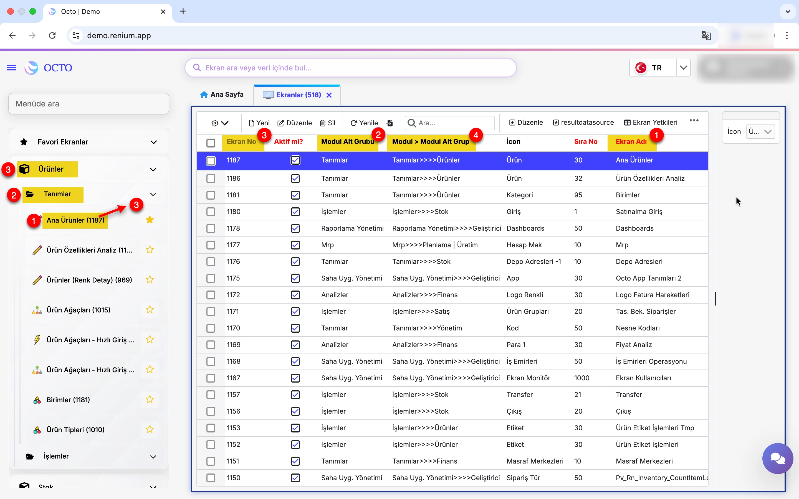
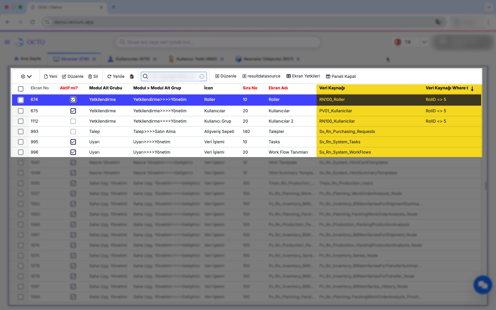
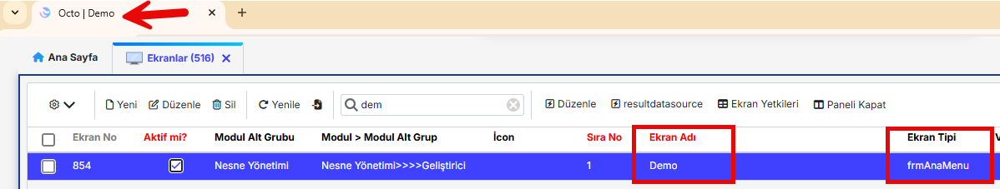

# Ekran Yönetimi

## Görünüm Özellikleri

 

Aşağıda belirtilen özellikler tüm ekran tipleri için tanımı zorunlu olan alanlardır. Açıklamaları aşağıdaki gibidir:
- **Aktif:** Aktif olmayan kayıtlar menüde görünmez. Checkbox işaretlenmelidir.
- **Modül Alt Grup:** Bu alan, tanımın menüde hangi modül ve modül alt grubu altında görüneceğini belirtir. Eğer istenen değer listede yer almıyorsa, `...` tuşları ile tanım ekranı açılarak gerekli tanım eklenebilir. Tanımlama işlemi tamamlandıktan sonra, ekran tanımında uygun değer seçimi yapılmalıdır.

    Her modülün en az bir alt modülü bulunmak zorundadır. Modül Alt Grup tanımında zaten modül bilgisi yer aldığı için, ekran tanımı sırasında ayrıca modül seçimi yapılmasına gerek yoktur.
- **Sıra No:** Ekranın Modül içinde hangi sırada görüneceğini ifade eder.
- **Ekran İsmi:** Ekranın menüde görüneceği ismi ifade eder.

 

- **İcon:** Ekranın menüde hangi iconla görüneceğini ifade eder. İstenen icon yoksa tanım ekranına gidilerek tanımı yapılabilir. İcon görselleri `.png/.jpg/.jpeg` formatında olmalıdır.


### Ek Özellikler

**DocUrl:** Ekran tanımında kayıt için tanımlanan DocUrl'i temsil eder. Ekran ile ilgili dokümana ulaşmanızı sağlar.

 

--- 

## Standart/Master-Detay Ekran

Standart/Master-Detay tanımı için [ekran tanımı](./ekran_yönetimi.md#ekran-yönetimi) kurallarına ek olarak, aşağıdaki tanımlar yapılır:
- **Veri nesnesi:** Ekran tanımındaki en önemli alandır. Ekranın veri kaynağını ifade eder. Açılır listede table ve view tipinde olan veri tabanı nesneleri gözükecektir. Sistem ekran tıklandığında aşağıdaki sorguyu çalıştırıp dönen veriyi gösterecektir.
    ```sql showLineNumbers
    SELECT * FROM [VeriNesnesi]
- **Detay Veri Nesnesi:** Master-Detay Ekran tipli ekran tanımındaki en önemli alandır. Detay ekranın veri kaynağını ifade eder. Açılır listede table ve view tipinde olan veri tabanı nesneleri gözükecektir. Sistem ekran tıklandığında detay ekran için aşağıdaki çalıştırıp dönen veriyi gösterecektir.

    ```sql showLineNumbers
    SELECT * FROM [DetayVeriNesnesi] 

:::info
Veri nesnesi PK alanı (nesnenin ilk alanı), Detay Veri nesnesi alanları içinde olmalıdır. Aksi halde, veri nesneleri arasında bağlantı sağlanamayacak ve ekran istenildiği gibi çalışamayacaktır.
:::

- **Master Where Text:** Veri nesnesi alanında tanımlanan nesnenin ekran açılışında tanımlanan filtre ile açılacağını ifade eder.
Sistem ekran tıklandığında aşağıdaki sorguyu çalıştırıp dönen veriyi gösterecektir.
    ```sql showLineNumbers
    SELECT * FROM [Veri nesnesi] WHERE [MasterWhereText]



---

## Ekran Tipleri

**Ekran Tipleri**, sistemde farklı amaçlara hizmet eden ve işlevlerinizi daha kolay gerçekleştirmenizi sağlayan ekran türleridir.  
Ekran oluştururken seçeceğiniz **Ekran Tipi** parametresi, hem tasarımsal hem de fonksiyonel** açıdan ekranın nasıl görüneceğini ve çalışacağını belirler.  
Yani, ekranın yapısı ve özellikleri seçtiğiniz ekran tipi temel alınarak oluşturulur.

- **frmDetailedObject:**  
  Master-Multi Detay ekran olarak da tanımlanabilir. Bir *Master ekran* ile bir veya birden fazla *Detay ekranın* bir araya gelmesiyle oluşur. Bu tip ekranlar, bir ana kayda bağlı alt detayların görüntülenmesi ve yönetilmesi için kullanılır.  
  **Örnek:** *Ana Ürünler ekranı.*

  

---

- **frmAnaMenu:**  
  Bu ekran tipi, sistemin **ana menü yapısını** temsil eder. frmAnaMenu için tanımlanan ekran ismi, üst menüde yer alan bölüm adı olarak görünür. Genellikle proje veya kurum adının bu alanda yer alması önerilir.

  

---

- **frmYetki:**  
  Sistem genelinde **yetkilendirme ve erişim ayarlarının** yapıldığı ekran tipidir.  
  Roller, kullanıcılar ve erişim izinleri bu yapı üzerinden tanımlanır.

  

---

- **Boş Olması Durumu:**  


---
