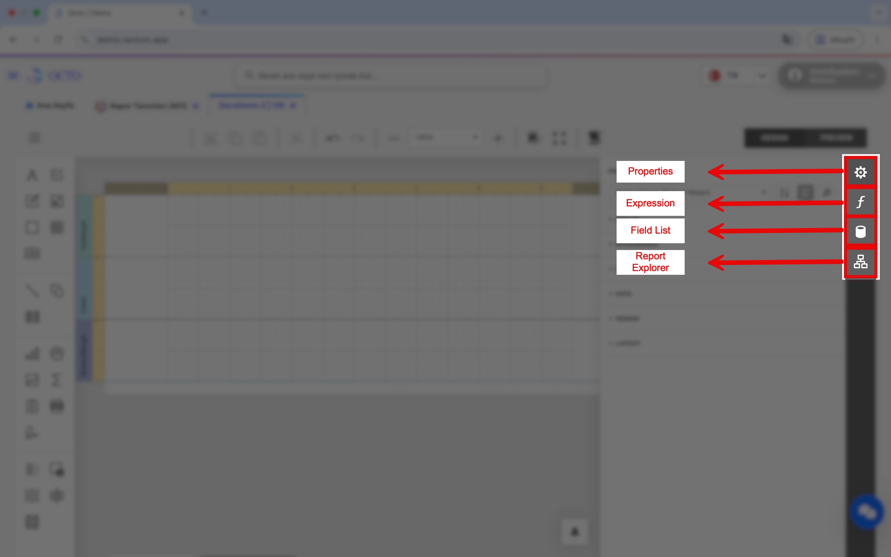

# Rapor Tasarımı

Rapor tasarımı, sistemdeki verileri ve tasarım aracını kullanarak dilediğiniz raporları oluşturmanıza ve görüntülemenize olanak tanır.

## Rapor Tanımları

*Geliştirici* modülü altında yer alan *Rapor Tanımları* ekranı ile tanımladığınız raporları detaylı olarak görüntüleyebilir ve yönetebilirsiniz. Bu ekranda;
- Yeni rapor oluşturabilir,
- Daha önce oluşturduğunuz raporları düzenleyebilir,
- İhtiyaç kalmadığında raporları silebilirsiniz.

## Yeni Rapor Oluşturma

Yeni bir rapor oluşturmak için aşağıdaki adımları izleyebilirsiniz:


1. **Rapor Tasarlayıcısı** butonuna tıklayınız.  
   Bu işlem sizi **Rapor Tasarımı** ekranına yönlendirecektir.  
2. Sol üst köşede bulunan ☰ (**Hamburger menü**) ikonuna tıklayınız.  
3. Açılan menüden **New** seçeneğini seçiniz.  
   Bu adım sonucunda ekranda **boş bir rapor sayfası** oluşturulacaktır.  
4. Raporunuzu kaydetmek için tekrar ☰ (**Hamburger menü**) ikonuna tıklayınız.  
5. Menüden **Save** seçeneğini seçiniz.  
6. Açılan pencerede raporunuza anlamlı bir **isim verin** ve ardından **Save** butonuna tıklayarak kaydedin.  

:::tip
Raporunuza isim vermeden kaydederseniz, daha sonra bu rapora erişemeyebilirsiniz. Bu nedenle, kolay hatırlanabilir ve içeriği yansıtan bir isim kullanmanız önerilir.
:::

### Veri Kaynağı Bağlantısı

Raporunuzda göstermek istediğiniz verileri, ilgili tablolardan **SQL sorguları** aracılığıyla *Rapor Tasarlayıcısına* dahil etmeniz gerekmektedir.  

Bu işlemi gerçekleştirmek için aşağıdaki adımları izleyebilirsiniz:



1. Sağ tarafta bulunan menüden **Field List** sekmesine tıklayınız.  


2. **SqlDataSource** başlığı yanında yer alan **Add Query** butonuna basınız.  
3. Açılan pencerede sorgunuza bir **isim** veriniz.  
4. SQL sorgunuzu doğrudan yazabilirsiniz, ancak tabloları ve alan adlarını daha net görebilmek için **Run Query Builder** butonuna tıklayarak **Query Builder** ekranını açmanız önerilir.  
5. Açılan **Query Builder** ekranında, sağ tarafta yer alan **View** ve **Table** listelerinden raporunuza dahil etmek istediğiniz alanları seçiniz.  
6. Seçtiğiniz alanlar artık **Rapor Tasarım Aracı** içinde kullanılabilir hale gelecektir.  
7. Raporunuzun belirli filtrelerle çalışmasını istiyorsanız da, **Parameters** alanından parametre ekleyebilirsiniz:  
      
   - **+ (Ekle)** simgesine tıklayın.  
   - Açılan alanda parametrenize bir **isim** verin isterseniz description alanına **açıklama** da ekleyebilirsiniz.  
   - **Type (Veri Tipi)** alanından uygun veri tipini seçin (*String, Int, Date* vb.).  
   - Gerekli ayarları tamamladıktan sonra **Kaydet** butonuna basın.  

#### Veri Kaynağı Ayarları


SQL kaynağınızı ve parametrelerinizi oluşturduktan sonra, Rapor Tasarlayıcısında sağ tarafta **Properties** ekranında **Report Tasks** başlığı altında aşağıdaki değerleri giriniz:  
- **Data Source**  
- **Data Member**  
- **Filter String:** Raporun filtreleme koşullarını belirler.  
  Burada, filtreleme işlemini veritabanındaki `WHERE` koşulu gibi düşünebilirsiniz.  
  **Oluşturduğunuz parametrelerin hangi durumda kullanılacağını bu alanda tanımlayabilirsiniz.**

İçeri aktardığınız veriler ve oluşturduğunuz parametreler, **Field List** alanının altında **hiyerarşik bir yapı** şeklinde görüntülenir.   
Buradan istediğiniz alanı **sürükle-bırak (drag & drop)** yöntemiyle doğrudan rapor tasarım alanına ekleyebilirsiniz.  

### Raporun Tasarımı


- Sol tarafata bulunan tasarım aracından istediğiniz bileşeni raporunuza ekleyebilirsiniz. (grafik, resim, text, imza etc.)
- **Report Explorer** kısmında, oluşturduğunuz raporun tüm bileşenlerinin **hiyerarşik yapısını** inceleyebilirsiniz. Bu yapı, raporun genel organizasyonunu kolayca yönetmenizi sağlar.

### Raporun Ekranlarla İlişkilendirilmesi

Oluşturduğunuz raporları belirli ekranlarda görüntüleyebilmek için bu raporları ilgili ekranlara **manuel olarak eklemeniz** gerekir. Bunun için aşağıdaki adımları izleyebilirsiniz:


1. Raporu eklemek istediğiniz ekrana gidiniz.  
2. Araç çubuğunun en başında bulunan ⚙️ simgesine tıklayarak **Octo Lab’e Git** seçeneğini seçiniz.  
3. Octo Lab ekranı açıldığında **Belgeler** sekmesine gidiniz.  
4. Araç çubuğundan **Yeni** butonuna tıklayınız.  
5. Açılan formda aşağıdaki alanları doldurunuz:  
   - **Rapor ID:** Oluşturduğunuz raporun ID’sini giriniz. (Eğer bilmiyorsanız, *Rapor Tanımları* ekranından rapor ID’sine ulaşabilirsiniz.)  
   - **Rapor Adı:** Rapor için görünecek ismi giriniz.  
   - **Eğer raporunuzda parametre kullanıyorsanız,**
      - **ITFieldName:** Eğer raporunuzda parametre kullanıyorsanız, bu alanda parametrenizin ekran üzerindeki adını yazmanız gerekmektedir.
      - **DITFİlterFieldName:** Raporunuzu oluştururken belirlediğiniz parametre değişkeninin adını giriniz. 
   - **Sıra No**
6. Bu alanları doldurduktan sonra **Kaydet** butonuna basınız.  

Bu işlemler tamamlandığında, oluşturduğunuz rapor **seçtiğiniz ekran** üzerinden erişilebilir ve kolayca görüntülenebilir hale gelecektir.  
Artık raporunuz, tanımladığınız veri kaynağı ve parametrelerle birlikte aktif olarak kullanılabilir durumdadır.

### Raporun Görüntülenmesi


Oluşturduğunuz raporu Octo Lab ile ilgili ekranlara ekledikten sonra, raporu çalıştırmak istediğiniz kayda sağ tıklayarak **Raporlar** alanına ulaşabilirsiniz. Bu alanda oluşturduğunuz tüm raporlar listelenecektir. Görüntülemek istediğiniz raporu seçtiğinizde, sistem raporu otomatik olarak çalıştırarak ilgili verileri ekrana getirir. Böylece, seçtiğiniz kayıt üzerinden raporunuzu kolayca görüntüleyebilirsiniz.

## Rapor Dosyalarının İsimlendirmesi

Raporlarınızı dışa aktarırken, sistem **dosya isimlerini otomatik ve özel kurallara göre** oluşturur. Bu işlemi **Rapor Tasarlayıcısı** ekranından yönetebilirsiniz. Sistem, rapor dışarıya aktarılmadan önce veri kaynağındaki bazı alanları kullanarak dinamik bir dosya adı üretir.

Bu sayede her rapor, içeriğine uygun ve benzersiz bir adla kaydedilmiş olur. Bunu yapmak için:

1. Dışa aktarmak istediğiniz raporu **Rapor Tasarlayıcısı** içinde açınız.
2. Araç çubuğunda bulunan **Scripts** butonuna tıklayınız.
3. Bu alanda yazacağınız **script kodu** ile, dışa aktarılacak rapor dosyasının adını ve diğer özelliklerini özelleştirebilirsiniz.

:::tip[Örnek]
```
using System.Text.RegularExpressions;
using System.Collections.Generic;
private void XtraReport_BeforePrint(object sender, System.ComponentModel.CancelEventArgs e) {
    
    var report = sender as XtraReport;

    var activityNoValue = report.GetCurrentColumnValue("OrderId");
    var firmNameValue = report.GetCurrentColumnValue("ProjectName");
    var orderDateValue = report.GetCurrentColumnValue("SalesOrderDate");
    
    string activityNo = activityNoValue != null ? activityNoValue.ToString() : "DefaultActivity";
    string firmName = firmNameValue != null ? firmNameValue.ToString() : "DefaultFirm";
    string orderDate = orderDateValue != null ? orderDateValue .ToString() : "DefaultDate";
    
     firmName = Regex.Replace(firmName , @"[^a-zA-Z0-9çğıöşüÇĞİÖŞÜ\.\- ]", "");
     orderDate = Regex.Replace(orderDate , @"[^a-zA-Z0-9çğıöşüÇĞİÖŞÜ\.\- ]", "");

         var fileName = string.Format("{0}_{1}_{2}", activityNo, firmName, orderDate);
    
    var pdfExportOptions = report.ExportOptions.Pdf;
    pdfExportOptions.DocumentOptions.Title = fileName;

    report.Name = fileName;

}
```

Örnek scriptte üç ana adım bulunmaktadır:
1. `OrderID`, `ProjectName` ve `SalesOrderDate` verileri rapordan alınır.  
2. Alınan değerler, boşluk ve özel karakter içermeyecek şekilde düzenlenir.  
3. Formatlanmış veriler kullanılarak dışa aktarılacak dosyanın adı `OrderID_ProjectName_SalesOrderDate.pdf` şeklinde belirlenir.

- **OrderID = 1, ProjectName = demo, SalesOrderDate = 24.10.2025 olduğu bir rapor dosyası dışarı aktarılırken oluşacak dosya adı `1_demo_24102025.pdf` şeklindedir.**
:::

import LiteYouTubeEmbed from 'react-lite-youtube-embed';

<div className="video-container">
  <LiteYouTubeEmbed
    id="wDqEqHtjM8s"
    params="autoplay=1&autohide=1&showinfo=0&rel=0"
    title="Docusaurus: Documentation Made Easy"
    poster="maxresdefault"
    webp
  />
</div>