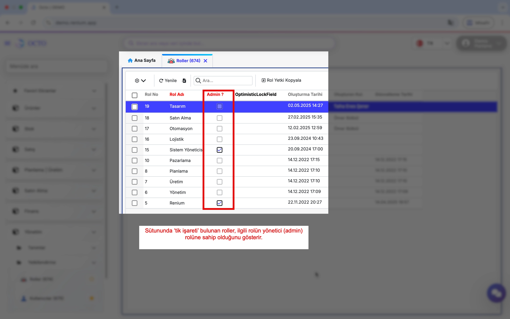
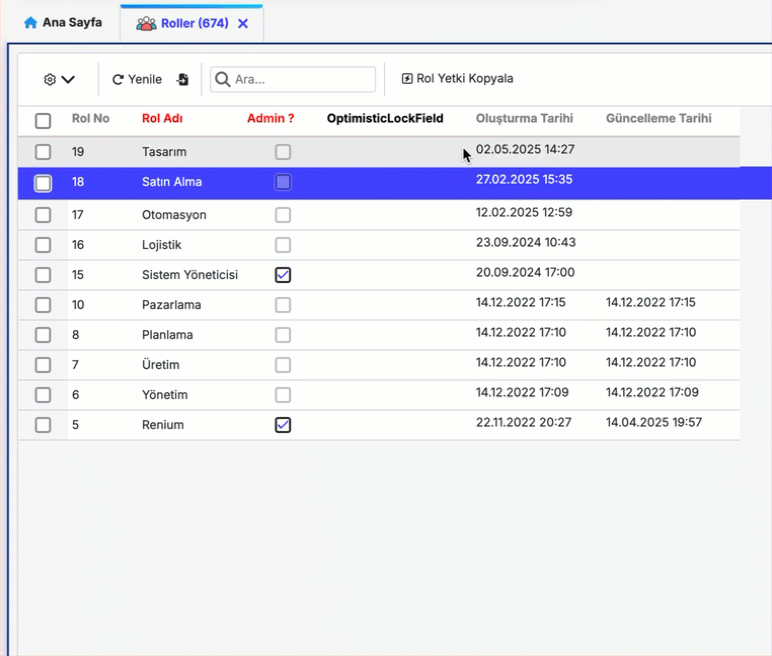
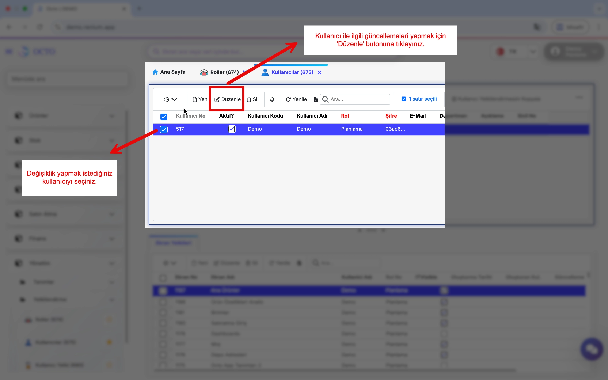
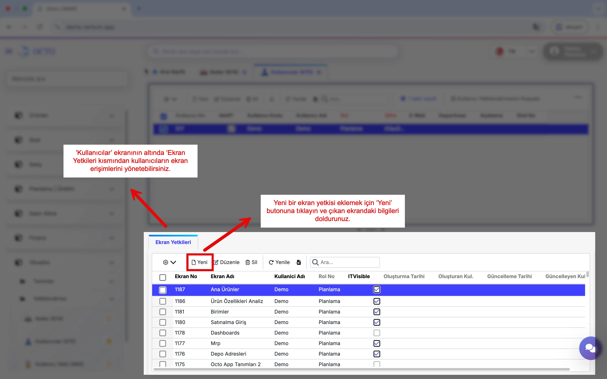

# Yetkilendirme

**Yetkilendirme** bölümü, sistemdeki kullanıcıların erişim düzeylerini ve izinlerini yönetmenizi sağlar. Bu alan üzerinden yeni roller tanımlayabilir, kullanıcı hesaplarını oluşturup düzenleyebilir ve her kullanıcıya özel ekran veya modül bazlı yetkiler atayabilirsiniz. Böylece platform üzerinde kimlerin hangi işlemleri gerçekleştirebileceğini kolayca kontrol edebilirsiniz. 

:::info
Yetkilendirme işlemleri yalnızca **admin yetkilerine sahip** roller tarafından gerçekleştirilebilir. Bir kullanıcının bu yetkiye sahip olup olmadığını kontrol etmek için **Yönetim** altındaki **Roller** ekranına gidiniz.  

İlgili rolün satırında bulunan **Admin?** sütunu işaretli ise, bu o rolün ve o role atanmış kullanıcıların **yönetici (admin)** yetkilerine sahip olduğunu gösterir.

:::

## Roller

Kullanıcıların erişebilecekleri ekranlar ve yapabilecekleri işlemler, hangi role sahip olduklarına göre belirlenir. Bu sayede, farklı kullanıcılar farklı işlevleri yerine getirebilir ve sistem güvenliği sağlanmış olur.

Genellikle rol adı olarak organizasyon şemasında yer alan pozisyon veya görev adları kullanılır. Bu, rollerin tanımlanmasını ve kimin hangi yetkilere sahip olduğunu anlamayı kolaylaştırır.

### *Rol Tanımı Yapma*

Yeni bir rol tanımlarken, sistemde hazır olarak bulunan standart rollerden birini temel almanız önerilir. Oluşturmak istediğiniz role en yakın yetkilere sahip mevcut rolün yetkilerini **kopyalayarak** yeni rolünüzü hızlıca oluşturabilir ve ardından gerekli düzenlemeleri yapabilirsiniz.

Roller ekranında araç çubuğunun yanında bulunan **Rol Yetki Kopyala** butonuna tıklayarak seçeceğiniz rolün yetkilerini kopyalabilirsiniz.

## Kullanıcılar

Kullanıcı, sisteme erişim izni verilen ve belirli rollerle ilişkilendirilmiş kişileri ifade eder. Kullanıcının yetkileri, atanmış oldukları role göre farklılık gösterir.

### Yeni Kullanıcı Tanımlama

Yeni bir kullanıcı tanımlamak için;
- Yönetici modülü altında *Kullanıcı* ekranı tıklanır.
- Araç çubuğunda bulunan *Yeni* butonuna tıklanır.
- Açılan ekranda; 
    - **Kullanıcı Adı:** Kullanıcı adı girilir., 
    - **Şifre:** : Kullanıcının giriş ekranında kullanacağı şifre belirlenir.
    - **Rol:** Listeden istenen Rol seçilir.
    - **Kullanıcı Kodu:** Kullanıcının giriş ekranında kullanacağı kod girilir. Veri yönetimini kolaylaştırmak amacıyla, kullanıcı kodlarının standart bir formatta verilmesi önerilir.
bilgileri doldurulduktan sonra *kaydet* butonuna tıklanarak yeni kullanıcı oluşturulur.

Bu sayede seçtiğiniz rolde yeni bir kullanıcıyı oluşturmuş olursunuz.

:::danger[Dikkat]

Kullanıcının ekranlara erişimini sağlamak için [ekran yetkilendirmesi](./index.md#kullanıcı-yetki) yapılması gerektiği unutulmamalıdır. 
:::

### Kullanıcı Bilgileri Güncelleme

Sistemdeki herhangi bir kullanıcı ile ilgili rol, kullanıcı adı, şifre gibi bilgileri güncellemek için;
- Yönetici modülü altında *Kullanıcı* ekranı tıklanır.
- Ekrandan istediğiniz kullanıcı seçtikten sonra; araç çubuğunda bulunan *Düzenle* butonuna tıklanır
- Açılan ekranda düzenleme yapmak istediğiniz alanı güncelledikten sorna kaydet butonuna tıklayınız. 

## Kullanıcı Yetki

Kullanıcılara bir veya birden fazla ekranı, aynı anda hızlı ve kolay bir şekilde yetkilendirmek mümkündür. Bu işlem sayesinde kullanıcıların ilgili ekranlara erişimi sağlanır. Eğer gerekli yetkilendirmeler yapılmazsa, kullanıcılar sistemde bazı ekranları **göremeyebilir veya erişim hatası alabilir**.

Kullanıcılara ekran yetkileri tanımlamak için aşağıdaki adımları izleyebilirsiniz:

1. **Yönetim** modülü altındaki **Kullanıcılar** ekranına gidiniz.  
2. Kullanıcılar ekranında, detay ekranında bulunan **Ekran Yetkileri** sekmesine geçiniz.  
3. Araç çubuğundan **Yeni** butonuna tıklayınız.  
4. Açılan ekranda aşağıdaki alanları doldurunuz:
   - **Ekran Adı:** Yetki vermek istediğiniz ekranı listeden seçiniz.  
   - **Ekran No:** Yetki vermek istediğiniz ekranın kodunu giriniz. *Ekran Adı* seçildiğinde bu alan otomatik olarak doldurulur.  
   - **Kullanıcı Adı:** Seçtiğiniz ekranda yetki vermek istediğiniz kullanıcıyı seçiniz.  
5. Gerekli alanları doldurduktan sonra **Kaydet** butonuna tıklayarak kullanıcıya yeni yetki tanımlamasını tamamlayabilirsiniz.

### Ekran Yetkisi Kaldırma

 

Aynı şekilde kullanıcı ekran yetkisini kaldırmak için;
- Ekran Yetkileri kısmından kaldırmak istediğiniz yetkinin yanındaki checkbox'ı işaretleyiniz ve araç çubuğundan **Sil** butonuna tıklayınız.