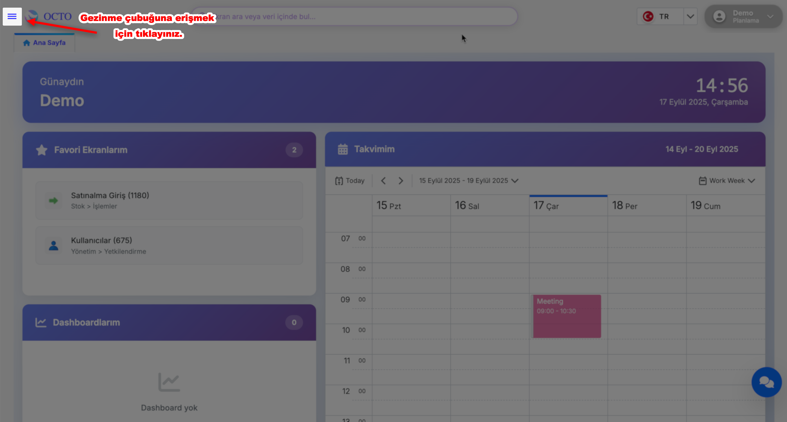
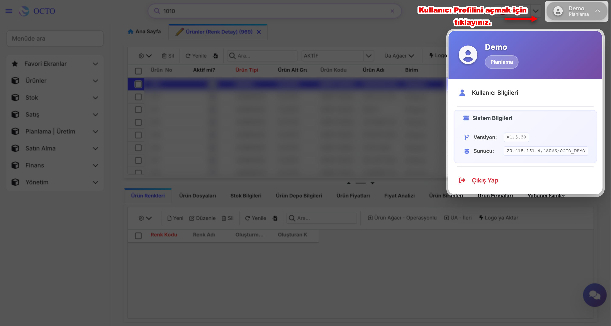

# Anasayfa

Ana Sayfa, Octo Web Platformu’na giriş yaptıktan sonra karşılaşacağınız ilk ekrandır. Buradan platformun tüm özelliklerine kolayca ulaşabilir ve hızlıca yönetebilirsiniz.

Ana sayfada görebileceğiniz başlıca bölümler:

- **Dashboard:** Projelerinizin genel durumunu ve özet bilgileri tek ekranda takip edin.
- **Takviminiz:** Toplantılarınızı, etkinliklerinizi ve önemli tarihleri düzenli şekilde görüntüleyin.
- **Favori Ekranlarınız:** Sık kullandığınız sayfaları favorilere ekleyerek kolay erişim sağlayın.
- **Gezinme Menüsü**
- **Arama Çubuğu** 
- **Kullanıcı Profili**

---

## Dashboard

Dashboardlar, Octo Web platformunun ana sayfasında yer alan ve kullanıcıya hızlı bir genel bakış sağlayan bölümüdür. Burada belirlediğiniz ekranlar ile ilgili kritik bilgileri özet halinde görüntüleyebilirsiniz.

:::warning
Dashboardlar her müşteriye özel olarak hazırlanır bu yüzde hesabınızda dashboard oluşması için ekibimizle iletişime geçmeniz gerekmektedir. İletişime geçilmediği sürece hesabınızda herhangi bir dashboard belirmeyecektir.
:::

---

## Takviminiz

Takviminiz, günlük toplantılarınızı düzenlemenizi ve yönetmenizi sağlar. Daha önce oluşturduğunuz toplantıları burada görebilir veya yeni toplantılar ekleyebilirsiniz.

### *Yeni Toplantı Oluşturma*

1. Takvimde istediğiniz tarihe gidin ve toplantıyı eklemek istediğiniz saat aralığına tıklayın.

2. Açılan pop-up ekranında toplantı ile ilgili bilgileri doldurun:
    - ***Subject:*** Toplantının başlığı veya konusu
    - ***Start/End:*** Toplantının başlangıç ve bitiş tarihi/saati
    - ***Repeat:*** Gerekirse toplantının tekrar sıklığı
    - ***Location:*** Toplantının yapılacağı yer veya link
    - ***Label:*** Toplantılarınızı kategorize etmek için kullanbilirsiniz
    - ***Status:*** Toplantı zamanındaki uygunluk durumunuzu belirtebilirsiniz
    - ***Description:*** Toplantı ile ilgili ek bilgiler veya notlar

3. Bilgileri girip kontrol ettikten sonra etkinliğinizi kaydetmek için pop-up ekranının sağ üst köşesinde bulunan **Save** butonuna, iptal etmek içinse **Discard** butonuna tıkalyınız.

4. Save butonuna tıkladıktan sonra, takvimde ilgili tarih ve saatte etkinliğiniz görünür hale gelir.

:::note

Takviminiz bölümüne eklediğiniz etkinlikler yada toplantılar size toplantılarınızı gerçekleştirmeniz için canlı bir ortam sunmaz, sadece bunları not etmenizi sağlar.

:::

---

## Favori Ekranlarınız

Favori Ekranlarınız, sık kullandığınız ve hızlı erişmek istediğiniz servis sayfalarına tek tıklamayla ulaşmanızı sağlar.

### *Favori Ekran Ekleme*

1. Anasayfanın sol üst köşesinde bulunan gezinme çubuğunu açın.
2. Favoriye eklemek istediğiniz ekranın bulunduğu dizine gidin.
3. Gezinme çubuğunda ilgili ekranın yanında bulunan yıldız (⭐️) ikonuna tıklayın. Bu işlem ekranı favori listenize ekler.

### *Favori Ekrandan Çıkarma*

Daha önce eklediğiniz bir ekranı favorilerinizden çıkarmak için, tekrar ilgili ekranın bulunduğu dizine gezinme çubuğu içinde gidin ve yıldız (⭐️) ikonuna tıklayın. Bu işlem ekranı favori listenizden kaldırır.

### *Favori Ekranlarınıza Erişim*

Eklediğiniz veya çıkardığınız ekranlar, **Ana Sayfa > Favori Ekranlarım** bölümünde görüntülenir.
Alternatif olarak, **Gezinme Çubuğu’nu** açıp en üstte bulunan **Favori Ekranlar** bölümüne tıklayarak da favori ekranlarınıza ulaşabilirsiniz.

---

## Gezinme Menüsü

Gezinme Menüsü, ekranın sol üst köşesinde bulunan **≡** sembolüne tıklayarak açılıp kapatılabilir. Bu menü sayesinde platform içindeki modül ve sayfaları görüntüleyebilir ve hızlıca erişebilirsiniz.

    

    
**Resimli yönlendirmeler için tıklayınız.**

    

    

- Menü açıldıktan sonra beliren Menüde Ara fonksiyonunu kullanarak istediğiniz ekranı hızlıca bulabilirsiniz.
- Menüde listelenen başlıklara tıklayarak farklı modüllere veya sayfalara geçiş yapabilirsiniz.

---

## Arama Çubuğu

Arama çubuğuna tıkladığınızda, aramak istediğiniz ekranın adını veya veriyi yazabilirsiniz. Doğrudan ilgili ekranların veya verilerin bulunduğu sayfalar listelenir, böylece ihtiyaç duyduğunuz bilgilere hızlı ve kolay bir şekilde ulaşabilirsiniz.

:::tip
Gezinme Menüsü’ndeki arama fonksiyonuna ek olarak, Arama Çubuğu **hem ekranlar hem de veriler** için arama yapmanızı sağlar. 
:::

---

## Kullanıcı Profili

**Kullanıcı Profili**, ana sayfanın sağ üst köşesinde yer alan kullanıcı adınıza tıklayarak açabileceğiniz bir menüdür. Menü üç bölümden oluşur:

**Resimli yönlendirmeler için tıklayınız.**

**1. Kullanıcı Bilgileri:**
- Bu butona tıkladığınızda anasayfanızda Kullanıcı Bilgileri sekmesi açılır.
- Sekme içinde hesabınızla ilgili detayları görebilir ve güncelleyebilirsiniz:
  - **Profil Fotoğrafı:** Mevcut fotoğrafınızı görebilir ve _Select File_ ile yeni bir fotoğraf yükleyebilirsiniz.
  - **Kullanıcı Bilgileri:** Hesap adınız ve sistemde hangi rolde bulunduğunuzu görebilirsiniz.
  - **Parola Bilgileri:** Parola değişikliğinizi bu alanda yapabilirsiniz.

**2. Sistem Bilgileri:** Platformun **versiyonu ve sunucu bilgileri** gibi teknik detayları görüntüleyebilirsiniz.

**3. Çıkış Yap:** Hesabınızdan güvenli bir şekilde çıkış yapmak için bu butona tıklayınız.

