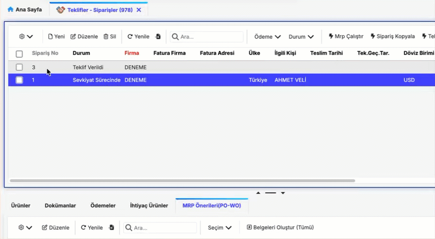
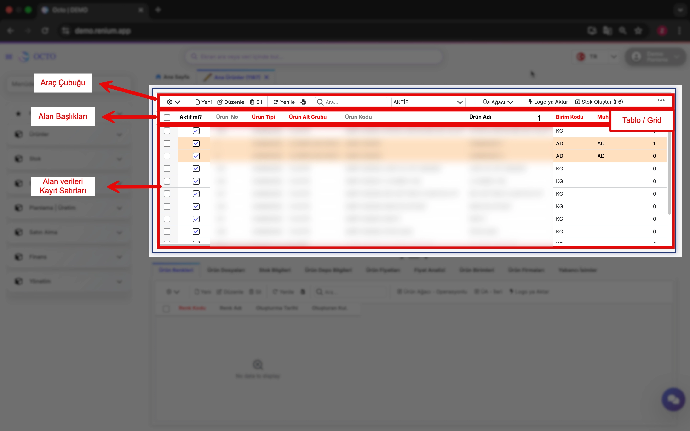
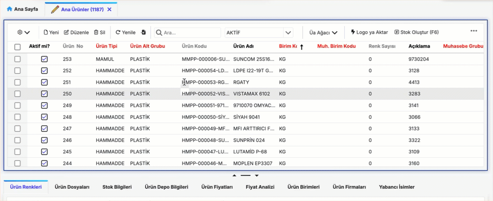
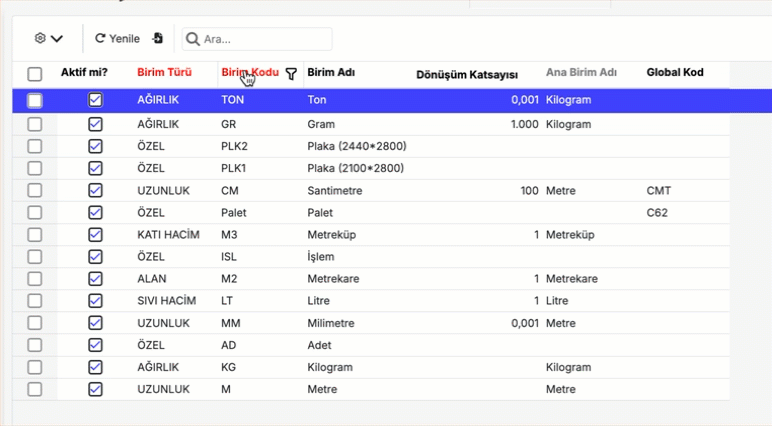

# General Usage

In this section, you will learn step by step how to use the core features of the program, navigate the interface, and make the most of the platform.

## Homepage

The **Homepage** is the first screen you encounter after logging into the Octo Web Platform. From here, you can easily access and manage all the platform’s features.

Main sections you can find on the homepage:

- **Dashboard:** Track the overall status and summary of your projects on a single screen.  
- **Your Calendar:** View and organize your meetings, events, and important dates in an orderly way.  
- **Favorite Screens:** Add frequently used pages to your favorites for quick access.  
- **Search Bar**  
- **User Profile**

---

### Dashboard

The **Dashboard** is a section on the Octo Web homepage that provides users with a quick overview.  
Here, you can view critical information related to the screens you’ve selected in a summarized form.

:::warning
Dashboards are customized for each customer. Therefore, to have a dashboard created in your account, you must contact our team. If you do not reach out, no dashboard will appear in your account.
:::

---

### Calendar

Your calendar helps you organize and manage your daily meetings. You can view previously created meetings here or add new ones.

#### *Creating a New Meeting*

1. Navigate to your desired date in the calendar and click on the time slot where you want to add the meeting.  

2. Fill in the meeting details in the pop-up window:  
   - ***Subject:*** The title or topic of the meeting  
   - ***Start/End:*** Start and end date/time of the meeting  
   - ***Repeat:*** Set recurrence frequency if necessary  
   - ***Location:*** Physical location or meeting link  
   - ***Label:*** Used to categorize your meetings  
   - ***Status:*** Indicate your availability during the meeting time  
   - ***Description:*** Add any extra details or notes about the meeting  

3. After reviewing the information, click **Save** (top right of the pop-up window) to confirm, or **Discard** to cancel.  

4. Once saved, your event will appear in the calendar on the selected date and time.

:::note
Events or meetings added to your calendar do **not** create a live meeting environment — they are for note-taking and reminder purposes only.
:::

---

### Favorite Screens

**Favorite Screens** allow you to quickly access the service pages you use most often — with just one click.

#### *Adding a Favorite Screen*

1. Open the navigation bar located in the upper-left corner of the homepage.  
2. Navigate to the directory where the screen you want to favorite is located.  
3. Click the star icon (⭐️) next to the relevant screen in the navigation bar.  
   This action adds the screen to your favorites list.

#### *Removing a Favorite Screen*

To remove a screen that you’ve previously added to your favorites, go to the same directory in the navigation bar and click the star icon (⭐️) again. This will remove the screen from your favorites list.

#### *Accessing Your Favorite Screens*

The screens you’ve added or removed are displayed under **Homepage > My Favorite Screens**. Alternatively, you can open the **Navigation Bar** and click **Favorite Screens** at the top to view them.

---

### Search Bar

Click the search bar and type the name of the screen or data you want to find. Relevant pages containing that screen or data will be listed, allowing you to access the information you need quickly and easily.

:::tip
In addition to the search function in the **Navigation Menu**, the Search Bar lets you search across **both screens and data**.
:::

---

## Menus

### Left Menu

The **Left Menu** can be opened or closed by clicking the **≡** icon located in the upper-left corner of the screen.  
This menu allows you to view and quickly access the modules and submodules within the platform.

**Module:**
- Used to group screens that serve similar functions.
- Common examples of modules in ERP systems include:
  * Products  
  * Inventory  
  * Sales  
  * Planning  
  * Production, etc.

**Submodule:**
- Smaller groups within a module that manage more specific functions. Submodules are useful when a module contains many screens, helping users quickly find the page they need.

:::warning
Users can only see the modules, submodules, and screens they are authorized to access. Therefore, the left menu may vary depending on each user's permissions.
:::

- Once the menu is open, you can use the **Search in Menu** function to find a screen quickly.  
- Click on the listed titles to navigate between different modules or pages.

:::tip
The numbers displayed next to modules and submodules represent their unique screen codes. You can search for a screen using either its name or its code.
:::

---

## Toolbar

The **Toolbar** is located at the top of the screen and provides quick access to commonly used actions. By default, it includes **Log**, **New**, **Edit**, **Delete**, **Import**, and **Search** functions, although these may vary depending on the page.

#### Log

All actions performed on the platform are recorded as **activity logs**, which can only be viewed by **system administrators**.  

To view the log information for a specific row or table, click the **⚙️ icon** next to the relevant field. From the dropdown menu, select **“Row Log”** or **“Table Log”** to see the change history.

---

#### New

The **New** button allows you to add a new record to the current screen. For detailed steps, refer to the [Adding a New Record](#adding-a-new-record) section of this documentation.

---

#### Edit

The **Edit** button allows you to update an existing record on the current screen. For more information, see the [Updating a Record](#updating-a-record) section.

---

#### Delete

The **Delete** button lets you remove one or multiple records from the current screen. You can find detailed instructions in the [Deleting a Record](#deleting-a-record) section.

---

#### Refresh

After making changes in the system, it may take a few moments for updates to appear on your screen. Click the **Refresh** button to reload the page data immediately. This action re-runs the background queries and ensures that the displayed information is up to date.

---

#### Import

The **Import** button allows you to upload data directly from an **Excel file** into the corresponding table.  

During import, the **first row of your Excel file** is treated as column headers, which must match the column names in Octo Web. Once mapping is complete, your data will be added to the table and become available for use in the system.

:::note
Make sure the column names in your Excel file match those in the system. Otherwise, the data may not be mapped correctly.
:::

---

#### Search

The **Search** function allows you to quickly locate a specific record within a table. Simply type any relevant value or attribute, and the matching entries will be displayed instantly.

---

## Screen Features

The screen layout is table (grid) based, similar in appearance and functionality to Excel. The structure of a screen typically consists of the **toolbar** at the top, followed by **column headers** and **data rows**.

### Read-Only Screens

By default, screens that allow new data entry have a **New** button. However, some screens do not include this option. These are **Read-Only Screens**.

On such screens, buttons like **New**, **Edit**, or **Delete** are not available; therefore, adding or updating data is not possible. **Read-Only** screens are generally used for **data analysis**, **reporting**, or **monitoring purposes**.

---

### Master - Master Detail Screens

Screens that contain two tables are called **Master-Detail Screens**, as shown in the image below. The second table displays the related detail records of the selected entry in the first table.

***Example: In the product screen shown, product information is displayed in the first table. The stock information for the selected product (Product #1) is displayed in the second table.***

- Screens are opened in **tabs**, which can be navigated via the tab bar.  
- Right-clicking on a tab opens a menu with related options for managing that tab.

---

## Record Operations

### Adding a New Record

New records can be added by clicking the **New** button on the corresponding module sub-pages. When adding a new record:
- **Red** fields indicate mandatory fields. These must be filled to complete the data entry.  
- **Gray** fields are **read-only** and cannot be modified.  
- **Black** fields are optional and do not require mandatory input.

- Some fields can only accept values defined in a library. These fields show a **(↓)** icon. Click this icon to select a value from the predefined list.  
- Clicking the down arrow on a field displays the library list.  
- You can filter the library by entering keywords in the list screen.  
- Clicking the **three dots (...)** next to a field navigates to the library’s source screen, where new entries can be added if needed.

- To add similar records, you can use the **row copy feature**:  
    1. Select the **checkbox** next to the row you want to copy.  
    2. Right-click on the row and select **“Copy Row”** from the menu. The row will open in the **new record screen**, where you can make necessary changes and click **Save** to create the new record.

*During record operations, various errors or warnings may appear. If a warning occurs, the operation will not be completed. If no warnings appear, the operation has been successfully completed.*

---

### Updating a Record

To update a record, follow the steps below:

1. Select the row by checking the **checkbox** on the far left of the corresponding record.  
2. Click the **"Edit"** button on the toolbar.  
3. In the opened screen, you can view details of the selected row and modify the desired fields.  

After making the necessary changes, click **"Save"** to update the record.

---

### Deleting a Record

To delete a record, select the **checkbox** on the far left of the row and click the **Delete** button on the toolbar.  

#### Deleting Multiple Records

To delete multiple records, select the **checkboxes** of all rows you want to remove and click the **Delete** button on the toolbar.

---

## Filtering

The screens provide the following filtering methods. You can quickly access the data you need by choosing the most appropriate filtering method for your current requirement.

### In-Screen Search Bar

The *In-Screen Search Bar* is a standard search function available on every screen. By entering the value you want to search for, you can quickly find records within the table.

:::note
The in-screen search bar also supports advanced search functions to make your searches more effective:

- **Combined Search:**  
  You can search for multiple criteria simultaneously by using the `'+'` symbol.  
  **Example:** `rga + ham` → Returns records containing both *rga* and *“ham”*.  
  

---

- **Field-Based Search:**  
  To search within a specific column, enter the first letters of the column name, followed by a colon (`:`), and then your search term.  
  If the column name contains spaces, enclose it in double quotes (`" "`).  
  If the specified column is not found, the system searches all visible columns.  
  **Example:** `"Ürün Tipi": mamul`  
  

---

- **Phrases with Spaces:**  
  To search for phrases containing spaces, enclose the phrase in double quotes (`" "`).  
  **Example:** `"Alüminyum Profil"`  
  

---

- **Exclusion (Negative Search):**  
  To list records that do not contain a specific value, add a `-` at the beginning of the search term.  
  **Example:** `-ham` → Returns records that do **not** contain *ham*.  
  

---

- **Records Starting With:**  
  Use the `'` symbol to list records that start with a specific value.  
  **Example:** `'97` → Returns records starting with *“97”*.  
  

---

- **Search with ~:**  
  Add `~` to your search term to use wildcard matching.  

  - `%` → Represents zero or more characters.  
  - `_` → Represents a single character.  

  **Examples:**  
  - `~%gram` → Lists records that **end with** “gram”.  
  - `~kilo%` → Lists records that **start with** “kilo”.  
  

:::

### Column Filtering

> By clicking the **filter icon** next to each column, you can filter the data in that column according to your desired criteria.

---

### Filter by Record

> * To filter based on a specific value in a record, **right-click** on the value and select **Filter** from the context menu.  
> * This action creates a filter based on the selected value.  
> * To apply multiple filters, repeat the same steps for other values to create **combined filters**.

You can view the filters you have created in the **active filter** row located below the toolbar.

---

### Filter Row

> To access the filter row, **right-click** on the area where the column names are displayed and select **Filter Row** from the context menu. This will add a new row at the top of the table allowing you to enter or select desired values for each column to create filters.

## Views

By right-clicking on column headers in the table, you can perform the following actions:

* Sorting
* Grouping
* Hide/Change Column, Column Selector
* Column Width
* Save View
* Column Formatting
* Panel / Preview

---

### Sorting

Clicking on a column header activates the sorting feature, similar to Excel. Columns with active sorting display `(↓)` or `(↑)` symbols.

Clicking another column header clears previous sorting and activates the last clicked column. To perform linked sorting across multiple columns, hold the `Shift` key while clicking the headers.

To clear sorting on a column, right-click the column header and select **Clear Sorting**.

---

### Grouping

Right-click on a column header and select **Group by This Column** to enable grouping. This works similarly to Excel’s grouping feature.

---

### Hide/Change Column, Column Selector

You can rearrange columns by clicking and dragging column headers.

To hide a column, right-click the column header and select **Hide Column**. This will make the column invisible in the table.

To make hidden columns visible again or hide other columns, right-click any column and select **Column Selector**.  
A **checkbox list** of all column names will appear:  
- **Checked boxes** represent visible columns.  
- **Unchecked boxes** represent hidden columns.  

You can check or uncheck boxes to show or hide columns as needed.

---

### Column Width

You can adjust the width of columns as needed using two methods:

1. **Manual Adjustment:**  
   Drag the edge of a column header to set the desired width.

    

2. **Auto Fit:**  
   To automatically adjust columns to fit the data inside:  
   - Right-click on any column header  
   - Select **“Best Fit All Columns”** from the menu  
   All columns will adjust to the optimal width for their content.

    

This makes your tables more readable and organized.

---

### Save View

After customizing your table with grouping, filtering, or sorting, you can save it as a view for later use. Selecting a saved view automatically applies its grouping, filtering, sorting, and other settings.

To save a view:  

1. Click the ⚙️ icon on the toolbar.  
2. Select **“Save View”** from the menu.  
3. Give your view a name and save it.  

Later, you can quickly access this view by selecting its name from the view selector next to the toolbar.

  <table>
    <tr>
      <th>Save View</th>
      <td> </td>
    </tr>
    <tr>
      <th>Access View</th>
      <td> </td>
    </tr>
  </table>

---

### Panel / Preview

For long text or large images, a side preview panel opens, making it easier to view content. This allows you to inspect areas that are difficult to view directly on the grid.

