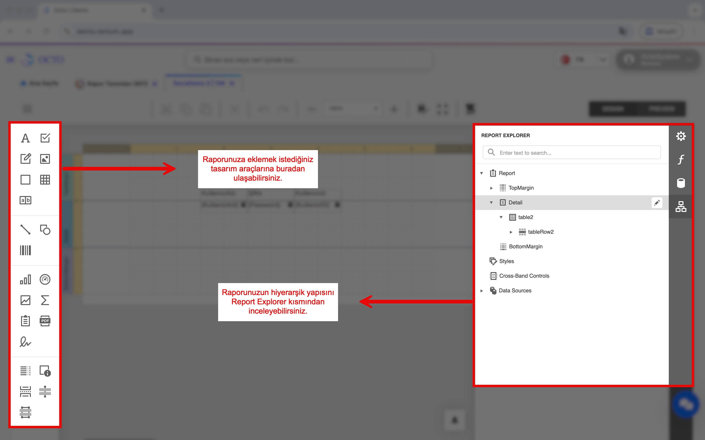

# Report Design

Report Design allows you to create and view custom reports using system data and the design tool.

## Report Definitions

The *Report Definitions* screen under the *Developer* module lets you view and manage the reports you have defined in detail. From this screen you can:
- Create a new report,
- Edit reports you have previously created,
- Delete reports that are no longer needed.

## Creating a New Report

To create a new report, follow these steps:

1. Click the **Report Designer** button.  
   This action will take you to the **Report Design** screen.  
2. Click the ☰ (**Hamburger menu**) icon in the top-left corner.  
3. From the menu that opens, select **New**.  
   A **blank report page** will be created on the screen.  
4. To save your report, click the ☰ (**Hamburger menu**) icon again.  
5. From the menu, select **Save**.  
6. In the dialog that opens, give your report a meaningful **name** and click **Save** to store it.

:::tip
If you save a report without giving it a name, you may not be able to access it later. It is recommended to use a memorable, descriptive name that reflects the report's content.
:::

### Data Source Connection

To include the data you want to display in your report, you need to add it to the **Report Designer** through **SQL queries** from the relevant tables.  

You can follow the steps below to complete this process:

1. Click on the **Field List** tab from the menu on the right side.  

2. Click the **Add Query** button next to the **SqlDataSource** section.  
3. In the window that opens, give your query a **name**.  
4. You can write your SQL query directly, but it’s recommended to click **Run Query Builder** to open the **Query Builder** screen, where you can view the tables and field names more clearly.  
5. In the **Query Builder** window, select the fields you want to include in your report from the **View** and **Table** lists on the right-hand side.  
6. The fields you selected will now be available within the **Report Designer**.  
7. If you want your report to work with specific filters, you can also add parameters from the **Parameters** section:  

   

   - Click the **+ (Add)** icon.  
   - Give your parameter a **name** and optionally add a **description**.  
   - Select the appropriate **Type (Data Type)** such as *String, Int, Date*, etc.  
   - After completing the required settings, click **Save**.  

#### Data Source Settings

After creating your SQL data source and parameters, go to the **Properties** panel on the right side of the **Report Designer**.  
Under the **Report Tasks** section, fill in the following values:  
- **Data Source**  
- **Data Member**  
- **Filter String:** Defines the filtering conditions of your report.  
  Think of this as similar to using a `WHERE` clause in a database query.  
  **You can specify under which conditions your created parameters will be applied in this field.**

The imported data and created parameters are displayed under the **Field List** section in a **hierarchical structure**.  
From here, you can add any desired field directly to the report design area using the **drag-and-drop** method.

### Report Design

- You can add any desired component (chart, image, text, signature, etc.) to your report from the design tool on the **left panel**.  
- In the **Report Explorer** section, you can review the **hierarchical structure** of all the components in your report.  
  This structure helps you easily manage and organize the overall layout of your report.

### Connecting the Report to Screens

To display the reports you have created on specific screens, you need to **manually link** them to the relevant screens. Follow the steps below:

1. Go to the screen where you want to add the report.  
2. Click the ⚙️ icon located at the beginning of the toolbar and select **Go to Octo Lab**.  
3. Once the **Octo Lab** screen opens, navigate to the **Documents** tab.  
4. Click the **New** button in the toolbar.  
5. In the form that appears, fill in the following fields:  
   - **Report ID:** Enter the ID of the report you created. (If you don’t know it, you can find the report ID in the *Report Definitions* screen.)  
   - **Report Name:** Enter a display name for the report.  
   - **If your report includes parameters:**  
      - **ITFieldName:** Enter the name of the parameter as it appears on the screen.  
      - **DITFilterFieldName:** Enter the name of the parameter variable defined in your report.  
   - **Order No:** Define the display order of your report in the list.  
6. After filling out these fields, click **Save**.  

Once completed, your report will become **accessible through the selected screen** and can be easily viewed.  
Your report is now fully functional, ready to use with its defined data source and parameters.

### Viewing the Report

After linking your report to the relevant screens via **Octo Lab**, you can access it by right-clicking on the record you want to generate the report for and selecting the **Reports** section.  
All reports associated with that screen will be listed here.  

When you select the desired report, the system will automatically execute it and display the corresponding data on the screen.  
This allows you to easily view and analyze the report directly from the selected record.

## Naming Report Files

When exporting your reports, the system automatically generates **file names based on predefined dynamic rules**.  
This process can be managed from within the **Report Designer**.  
Before the report is exported, the system uses specific fields from the data source to create a unique and meaningful file name.

This ensures that each exported report is saved with a name that reflects its content.  
To configure this feature:

1. Open the report you wish to export in the **Report Designer**.  
2. Click the **Scripts** button on the toolbar.  
3. In the script area, you can define custom logic to set the exported report file name and other attributes.

:::tip[Example]

The example script follows three main steps:
1. Retrieve the values of `OrderID`, `ProjectName`, and `SalesOrderDate` from the report data.  
2. Format these values to remove spaces and special characters.  
3. Combine the formatted values to define the exported file name as `OrderID_ProjectName_SalesOrderDate.pdf`.

- **For example:**  
  If `OrderID = 1`, `ProjectName = demo`, and `SalesOrderDate = 24.10.2025`,  
  the exported file will be named `1_demo_24102025.pdf`.
:::
