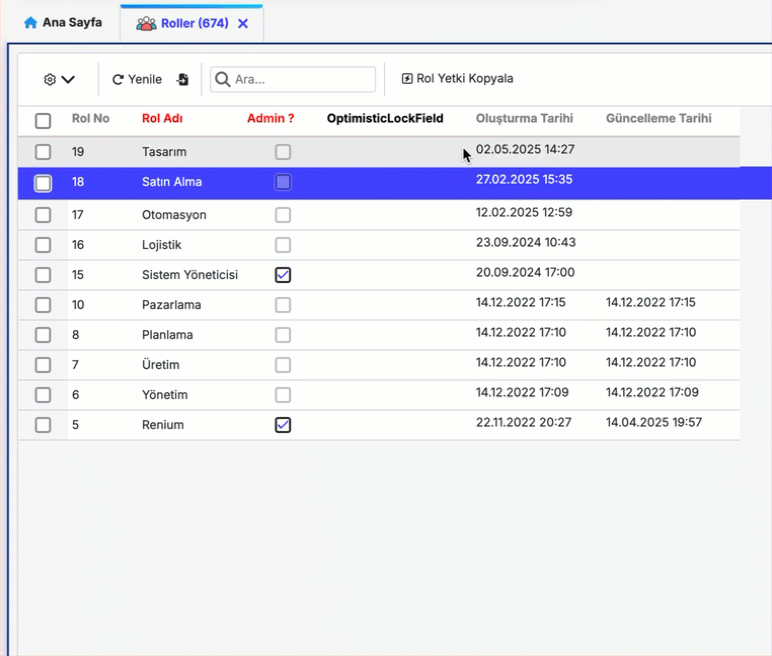
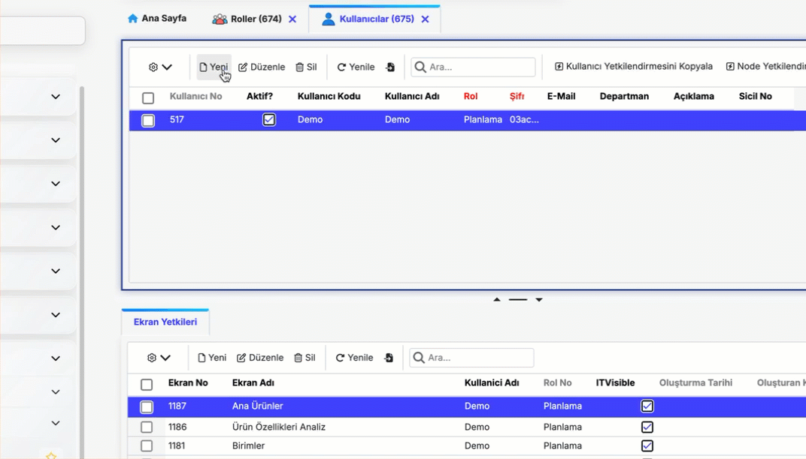
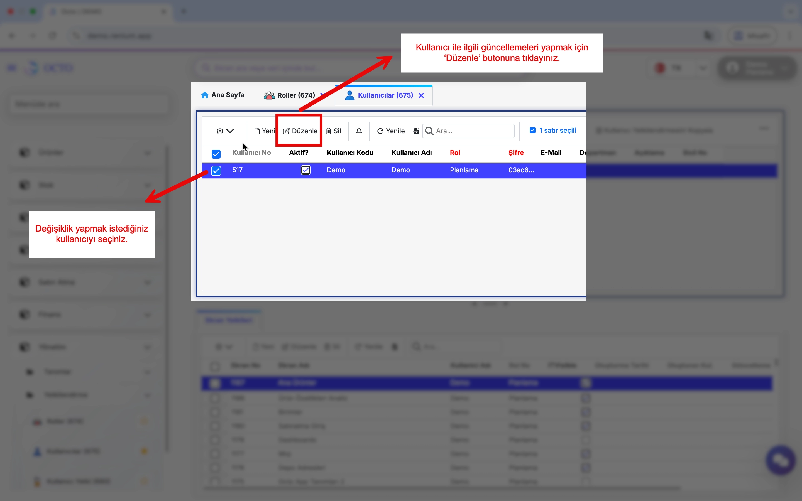
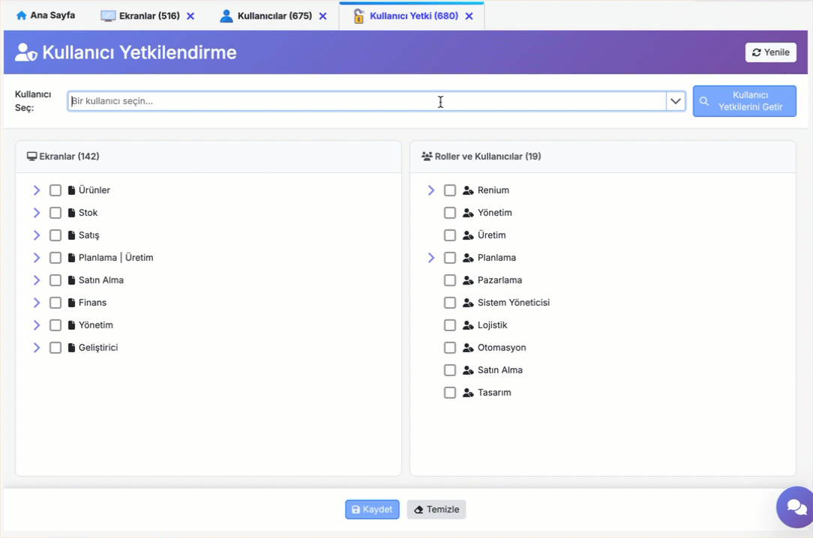

# Authorization

**The Authorization** section allows you to manage users’ access levels and permissions within the system. Here, you can define new roles, create and edit user accounts, and assign module- or screen-specific permissions to individual users. This makes it easy to control who can perform which actions on the platform.

:::info
Authorization tasks can only be performed by roles with admin privileges. To check whether a user has this privilege, go to the Roles screen under Management.

If the Admin? column is checked for a role, it indicates that the role—and all users assigned to it—have administrator (admin) privileges.

:::

## Roles

The screens users can access and the actions they can perform are determined by the roles they are assigned. This ensures that different users can carry out different functions while maintaining system security.

Role names usually correspond to positions or job titles in the organizational chart. This makes it easier to define roles and understand which permissions each user has.

### Creating a Role

When defining a new role, it is recommended to base it on one of the standard roles already available in the system. You can **copy** the permissions of an existing role that closely matches the new role you want to create, then make any necessary adjustments.

In the Roles screen, click the **Copy Role Permissions** button next to the toolbar to copy the permissions of the selected role.

## Users

A user refers to a person who is granted access to the system and is associated with specific roles. A user's permissions vary depending on the role(s) they are assigned.

### Creating a New User

To create a new user:
- Go to the *Users* screen under the Management module.
- Click the *New* button in the toolbar.
- In the opened form, fill in the following information:
    - **Username:** Enter the username.
    - **Password:** Set the password that the user will use to log in.
    - **Role:** Select the desired role from the list.
    - **User Code:** Enter the code the user will use at login. It is recommended to follow a standard format for user codes to facilitate data management.
- After filling in the details, click the *Save* button to create the new user.

This way, you will have created a new user with the selected role.

:::danger[Note]
Do not forget that to grant the user access to screens, [screen permissions](./index.md#kullanıcı-yetki) must be assigned.
:::

### Updating User Information

To update information such as role, username, or password for any user in the system:

- Go to the *Users* screen under the Management module.
- Select the desired user from the list and click the *Edit* button in the toolbar.
- Update the necessary fields in the opened form and click the **Save** button to apply changes.

### Removing a User

You can remove users from the system when they are no longer needed.

To delete one or more users, select the users on the *Users* screen. Then, click the **Delete** button in the toolbar to remove the selected user(s) from the system.

## User Permissions

It is possible to grant one or multiple screens to users quickly and easily. This ensures that users have access to the relevant screens. Without proper permissions users may **not see certain screens or encounter access errors**.

### Managing Screen Permissions

To assign screen permissions to users, follow these steps:

1. Navigate to the **User Permissions** screen under the Management module.
2. In the top section, select the user whose permissions you want to modify and click the **Get Screen Permissions** button.
3. In the lower section, the screens the selected user can access and their assigned roles will be listed.
4. Check the boxes next to the screens to grant access, or uncheck them to remove access.
5. After making the necessary adjustments, click the **Save** button to apply the changes.